# Hybrid Knowledge Base — Implementation Requirements
## Complete Pipeline: Input → Transform → Graph ← RAG ← Agent

> **Purpose:** This document is a step-by-step implementation guide. Every section answers three questions: *What goes in?* *What do you do to it?* *What comes out?* Anyone reading this document should be able to implement the full pipeline from scratch.

---

## Table of Contents

1. [Pipeline Overview](#1-pipeline-overview)
2. [Step 1 — INPUT: Source Collection](#2-step-1--input-source-collection)
   - [2.0 Tool Selection — When to Use What](#20-tool-selection--when-to-use-what)
   - [2.6 Connectors & Sync Service](#26-connectors--sync-service--external-source-integration)
3. [Step 2 — TRANSFORM: Extraction and Chunking](#3-step-2--transform-extraction-and-chunking)
   - [3.5 Quality & Scoring Schema](#35-quality--scoring-schema)
   - [3.6 Metadata Service — JSON Frontmatter](#36-metadata-service--json-frontmatter)
4. [Step 3 — GRAPH: Graph Hydration and Import](#4-step-3--graph-graph-hydration-and-import)
   - [4.6 Storage Layer — Complete Picture](#46-storage-layer--complete-picture)
5. [Step 4 — RAG: Vector Embedding and Storage](#5-step-4--rag-vector-embedding-and-storage)
6. [Step 5 — AGENT: Query, Retrieval, and Answer Assembly](#6-step-5--agent-query-retrieval-and-answer-assembly)
   - [6.5 PageIndex Tree Reasoning Engine](#65-pagindex-tree-reasoning-engine)
7. [Python Libraries — Complete Manifest](#7-python-libraries--complete-manifest)
8. [Deployment — Graph DB, Vector DB, API Server](#8-deployment--graph-db-vector-db-api-server)
9. [Bootstrap Sequence — Full End-to-End Run](#9-bootstrap-sequence--full-end-to-end-run)
10. [Data Contracts — JSON Schemas at Each Hand-off](#10-data-contracts--json-schemas-at-each-hand-off)
12. [Observability & Consumer Interfaces](#12-observability--consumer-interfaces)
13. [Pydantic Models — Complete Definitions](#13-pydantic-models--complete-definitions)
14. [fact\_to\_sentence() — Sentence Templates](#14-fact_to_sentence--sentence-templates)
15. [UI Layer — Web Interface](#15-ui-layer--web-interface)
16. [wiki\_to\_json.py Adapter](#16-wiki_to_jsonpy-adapter)
17. [DB Backend Protocol Abstractions](#17-db-backend-protocol-abstractions)
18. [MCP Server Tool Schemas](#18-mcp-server-tool-schemas)

---

## 0. Project Structure & File Layout

This is the canonical folder tree. An agent creating the codebase **must produce every file listed here**. Each comment is the file's single responsibility. Do not combine responsibilities across files.

```
knowledge-base/
├── pyproject.toml                     # All Python dependencies (§7.1)
├── docker-compose.yml                 # Full stack: Neo4j, Chroma, API, Observability (§8.1)
├── Dockerfile                         # Builds src/ as the kb-api Docker image
├── .env.example                       # All required env vars — copy to .env before running
├── README.md
│
├── src/
│   ├── api/
│   │   ├── __init__.py
│   │   ├── main.py                    # FastAPI app: include routers, mount ui/dist/, CORS middleware
│   │   ├── routes/
│   │   │   ├── __init__.py
│   │   │   ├── ingest.py              # POST /api/ingest/file|repo|url; GET /api/ingest/jobs; GET /api/ingest/jobs/{id}; DELETE /api/ingest/jobs/{id}
│   │   │   ├── query.py               # POST /api/query
│   │   │   └── stats.py               # GET /api/stats; GET /api/health
│   │   └── schemas.py                 # Pydantic API request/response models (§15)
│   │
│   ├── pipeline/
│   │   ├── __init__.py
│   │   ├── walker.py                  # walk_dir(root, exts, excludes) → list[Path]
│   │   ├── chunker.py                 # chunk_file(path, language, max_tokens) → list[Chunk]
│   │   ├── extractor.py               # extract_all_layers(chunks) → dict[int, list]; fact_to_sentence(fact) → str
│   │   ├── resolver.py                # resolve_entities(input_dir, output_dir, threshold) → EntityRegistry
│   │   ├── hydrator.py                # hydrate(facts, registry) → list[GraphTriple]
│   │   └── job_manager.py             # IngestJob dataclass; JobManager: submit/get/cancel/list
│   │
│   ├── storage/
│   │   ├── __init__.py
│   │   ├── protocols.py               # VectorStore(Protocol) + GraphStore(Protocol) (§17)
│   │   ├── chroma_store.py            # ChromaStore implements VectorStore
│   │   ├── neo4j_store.py             # Neo4jStore implements GraphStore
│   │   ├── kuzu_store.py              # KuzuStore implements GraphStore — embedded, no Docker needed
│   │   └── git_store.py               # GitStore: commit_wiki_page(path, content), read_wiki_page(path) → str
│   │
│   ├── adapters/
│   │   ├── __init__.py
│   │   ├── wiki_to_json.py            # convert_wiki_to_chunks(wiki_dir) → list[Chunk] (§16)
│   │   ├── git_ingester.py            # clone_repo(url, branch, dest_dir) → Path; uses gitpython
│   │   └── file_ingester.py           # save_upload(file_bytes, filename, dest_dir) → Path
│   │
│   ├── models/
│   │   ├── __init__.py
│   │   └── facts.py                   # All Pydantic fact models + EntityRegistry (§13)
│   │
│   ├── agent/
│   │   ├── __init__.py
│   │   ├── classifier.py              # classify(question) → IntentResult
│   │   ├── graph_retriever.py         # retrieve_graph(intent, graph_store) → list[dict]
│   │   ├── vector_retriever.py        # retrieve_vector(question, vector_store, top_k, filter) → list[VectorDocument]
│   │   ├── pagindex.py                # retrieve_pagindex(question, wiki_dir) → PageResult
│   │   └── assembler.py               # assemble(question, graph_results, vector_results, page_result) → QueryResponse
│   │
│   └── mcp/
│       ├── __init__.py
│       └── server.py                  # MCP FastAPI app on port 3000; tools: kb_query, kb_graph_query, kb_find_entity, kb_stats (§18)
│
├── ui/                                # React frontend — built to ui/dist/, served by FastAPI as static files
│   ├── package.json                   # React 18, TypeScript 5, Vite 5, Tailwind 3, TanStack Query v5, React Router v6
│   ├── tsconfig.json
│   ├── vite.config.ts                 # outDir: ../ui/dist; dev proxy: /api → http://localhost:8000
│   └── src/
│       ├── main.tsx                   # ReactDOM.createRoot + QueryClientProvider + RouterProvider
│       ├── App.tsx                    # createBrowserRouter: / → IngestPage, /query → QueryPage, /status → StatusPage
│       ├── types.ts                   # TypeScript interfaces mirroring all §13 + §15 Pydantic schemas
│       ├── api/
│       │   └── client.ts              # fetch wrappers: ingestFile(), ingestRepo(), ingestUrl(), listJobs(), pollJob(), runQuery(), getStats()
│       └── components/
│           ├── Layout.tsx             # Top nav (Ingest | Query | Status tabs) + <Outlet/>
│           ├── IngestPanel.tsx        # Tabs: Upload File | Git Repository | URL/Confluence
│           ├── JobList.tsx            # Polls GET /api/ingest/jobs every 3 s; renders a JobCard per job
│           ├── JobCard.tsx            # Progress bar, current step text, facts/nodes/vectors counts, status badge
│           ├── QueryPanel.tsx         # Search input + Submit; renders AnswerCard below when result arrives
│           ├── AnswerCard.tsx         # Answer text + confidence badge + graph paths + CitationList
│           └── StatsPanel.tsx         # GET /api/stats; renders count cards + per-collection breakdown table
│
├── scripts/
│   └── create_schema.py               # One-time setup: CREATE CONSTRAINT + INDEX on Neo4j
│
├── config/
│   ├── otel-collector.yaml
│   └── grafana/dashboards/
│
└── tests/
    ├── conftest.py                    # fixtures: mock_vector_store, mock_graph_store, sample_chunk, sample_entity_fact
    ├── test_chunker.py
    ├── test_extractor.py
    ├── test_resolver.py
    └── test_query.py
```

#### `.env.example` — all required variables

```bash
# ── LLM ──────────────────────────────────────────────────────────────────────
OPENAI_API_KEY=sk-...
LLM_MODEL=gpt-4o                          # extraction + answer generation
EMBEDDING_MODEL=text-embedding-3-large    # MUST match at ingest AND query time

# ── Graph DB ──────────────────────────────────────────────────────────────────
GRAPH_BACKEND=neo4j                        # neo4j | kuzu
NEO4J_URI=bolt://localhost:7687
NEO4J_USER=neo4j
NEO4J_PASSWORD=password

# ── Vector DB ─────────────────────────────────────────────────────────────────
VECTOR_BACKEND=chroma                      # chroma | weaviate | pinecone | qdrant
CHROMA_HOST=localhost
CHROMA_PORT=8001

# ── Storage paths ─────────────────────────────────────────────────────────────
RAW_DOCS_DIR=./raw_docs
WIKI_DIR=./wiki
INPUT_DIR=./input
OUTPUT_DIR=./output

# ── API server ─────────────────────────────────────────────────────────────────
API_HOST=0.0.0.0
API_PORT=8000
CORS_ORIGINS=http://localhost:5173         # comma-separated list

# ── Optional: source connectors ────────────────────────────────────────────────
GITHUB_TOKEN=ghp_...
CONFLUENCE_URL=https://yourorg.atlassian.net
CONFLUENCE_TOKEN=...
```

---

## 1. Pipeline Overview

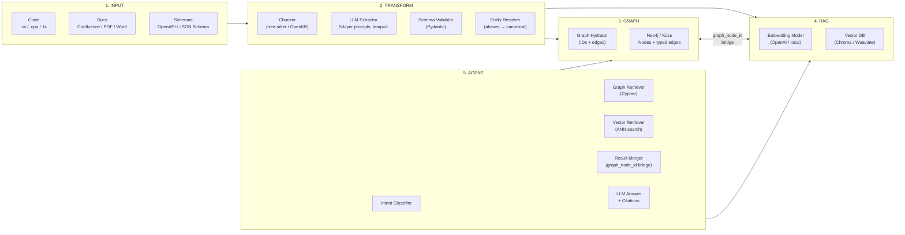

### Key Design Principles

| Principle | What it means |
|---|---|
| **Both DBs always active** | Every ingestion writes to Graph DB (structure) AND Vector DB (semantics) in parallel |
| **graph_node_id bridge** | Every vector document carries the ID of its corresponding Graph DB node — this is the join key at query time |
| **temperature = 0.0** | All LLM extraction calls use temperature 0 — no creativity, no hallucination |
| **5-layer extraction** | Code/docs are extracted into 5 typed fact layers, each with a distinct schema |
| **Entity resolution first** | Aliases must be resolved to canonical names before any graph or vector write |

---

## 2. Step 1 — INPUT: Source Collection

### 2.0 Tool Selection — When to Use What

Use this section first. Pick the right ingestion tool before you write any pipeline code.

#### Decision Table

| Your source is… | Use this tool | Why |
|---|---|---|
| `.cs`, `.cpp`, `.h`, `.ts`, `.js` source files | **tree-sitter chunker** (`kb extract`) | Understands code structure — splits at class/method boundaries, preserves doc comments, respects the AST. Plain text splitting loses context. |
| Unit test files (`.cs` xUnit, Jest `.test.ts`) | **tree-sitter chunker** (`kb extract`) | Same AST splitting; test methods become individual operational facts. |
| JSON Schema / OpenAPI (`.json`, `.yaml`) | **Direct LLM pass** (no chunker) | Schemas are small and self-contained — feed the whole file as one chunk directly to the Layer 3 prompt. |
| Confluence pages (cloud or export) | **OpenKB** (`openkb add <url>`) | OpenKB's wiki compiler synthesizes cross-page concepts and produces structured Markdown summaries — far better than raw HTML scraping. |
| SharePoint / Word documents (`.docx`) | **OpenKB** (`openkb add <file>`) | OpenKB handles `.docx` parsing, heading extraction, and cross-doc concept merging automatically. |
| PDF files (`.pdf`) | **OpenKB** (`openkb add <file>`) | OpenKB extracts text and section structure from PDFs. Raw PDF → text is lossy; OpenKB normalises it. |
| HTML pages or arbitrary URLs | **OpenKB** (`openkb add <url>`) | OpenKB strips navigation chrome, extracts body content, and maps it to the wiki concept model. |
| Runbooks (`.md`, `.pdf`, `.docx`) | **OpenKB** (`openkb add`) | Runbook steps become structured `DocumentSection` facts with cross-references to code entities. |
| Markdown files (`.md`) in `./docs/` | **OpenKB** preferred, tree-sitter fallback | If the `.md` file is a design doc or architecture note → OpenKB (cross-doc synthesis). If it is auto-generated from code (e.g. Sandcastle output) → `kb extract` with `##` heading splitter. |
| Markdown files (`.md`) in `./src/` | **tree-sitter** (`kb extract`) | In-repo READMEs and inline docs are treated as part of the code corpus — split at `##` headings by the chunker. |
| A folder with mixed content (code + docs) | **Both, in parallel** | Run `kb extract` on `./src/` and `openkb add` on `./docs/` simultaneously. The output of both feeds into the same chunk queue before TRANSFORM. |

#### Decision Flowchart

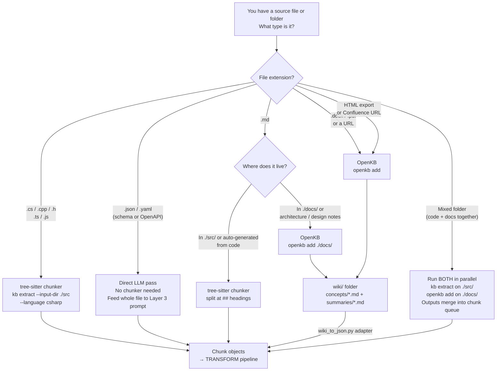

#### Key Differences Between the Two Tools

| Aspect | tree-sitter (`kb extract`) | OpenKB (`openkb add`) |
|---|---|---|
| **Splits by** | AST nodes — class, method, function | Semantic concepts — synthesises across multiple source docs |
| **Output** | One chunk per code node | One concept page per synthesised topic + one summary per source |
| **Cross-file linking** | No (done later in entity resolution) | Yes — OpenKB merges references across all ingested docs into unified concept pages |
| **Handles binary/PDF** | No | Yes |
| **Requires network** | No | Only for URL sources; local files work offline |
| **Token budget control** | `--chunk-size-tokens` flag | Controlled by OpenKB's own page limits |
| **Incremental update** | `kb extract --files changed.cs` | `openkb add <changed_file>` (re-ingests single source) |
| **Output format** | JSON chunk objects directly | Markdown wiki pages → converted by `wiki_to_json.py` adapter |

> **Rule of thumb:** If the source has syntax structure (code, schema) → tree-sitter. If the source has human-written narrative (docs, runbooks, Confluence) → OpenKB.

---

### 2.1 Supported Source Types

| Source type | Format | Ingestion path | Mode |
|---|---|---|---|
| C# source files | `.cs` | tree-sitter chunker | A / B |
| C++ source files | `.cpp`, `.h` | tree-sitter chunker | A / B |
| TypeScript / JavaScript | `.ts`, `.js` | tree-sitter chunker | A / B |
| Unit test files | `.cs` test classes, Jest `.test.ts` | tree-sitter chunker | A / B |
| JSON Schema / OpenAPI | `.json`, `.yaml` | direct LLM pass (no chunking needed for small schemas) | A / B |
| XML doc comments | inline in `.cs` / `.cpp` | extracted by chunker as part of method chunk | A / B |
| Confluence pages | HTML export or REST API | OpenKB `openkb add` | C |
| SharePoint documents | `.docx`, `.pdf` | OpenKB `openkb add` | C |
| Word documents | `.docx` | OpenKB `openkb add` | C |
| PDF files | `.pdf` | OpenKB `openkb add` | C |
| Markdown files | `.md` | split at `##` headings OR OpenKB | A / C |
| HTML pages / URLs | `.html` or `https://…` | OpenKB `openkb add <url>` | C |
| Runbooks | `.md`, `.pdf`, `.docx` | OpenKB `openkb add` | C |

> **Mode A** = manual extraction (you run prompts yourself). **Mode B** = automated pipeline (`kb extract`). **Mode C** = OpenKB document pre-processing.

### 2.2 What INPUT Provides to the Next Step

**Output of this step:** raw text chunks with source metadata.

Each chunk carries:

```json
{
  "chunk_id": "sha256[:16] of file_path + start_line",
  "source_type": "code | confluence | sharepoint | openapi | runbook | database | jira",
  "source_ref": "relative/path/or/url",
  "source_line_start": 42,
  "source_line_end": 78,
  "language": "csharp | cpp | typescript | markdown | html | json",
  "content": "<raw text of the chunk>",
  "estimated_tokens": 1200
}
```

### 2.3 Input Collection Flow

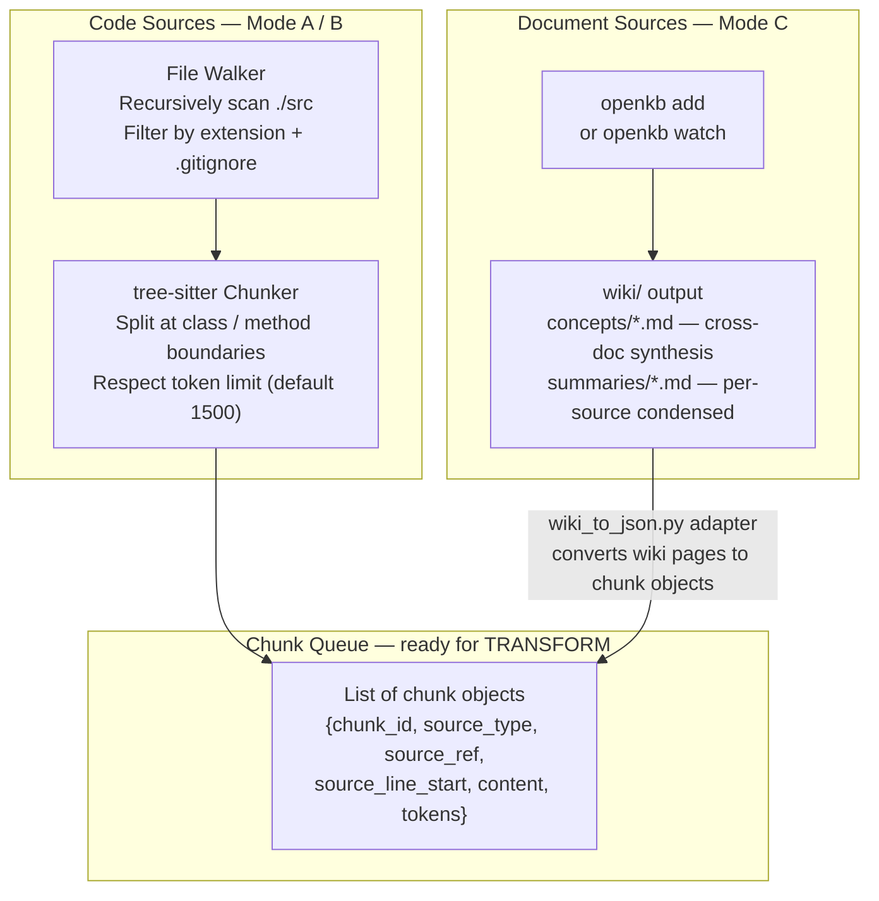

### 2.4 File Walker — What It Does

```python
# extraction/walker.py — purpose and interface
# Input:  repo_root (str), extensions ([".cs", ".cpp", ".ts"]), exclude_patterns
# Output: list of file paths, filtered by .gitignore and explicit excludes
#
# Libraries: pathlib (stdlib), gitpython (optional — for .gitignore parsing)
#
# Key rule: exclude test files from structural extraction (include in operational extraction)
# Key rule: respect token budget — files over 100K tokens are split before passing to chunker
```

### 2.5 Chunker — What It Does

```python
# extraction/chunker.py — purpose and interface
# Input:  file path, source language, max_tokens (default 1500)
# Output: list of Chunk objects (see schema above)
#
# Libraries: tree-sitter>=0.22.0, tree-sitter-languages>=1.10.0, tiktoken>=0.7.0
#
# Strategy:
#   1. Parse file with tree-sitter to get AST
#   2. Walk AST to find class_declaration, method_declaration, function_declaration nodes
#   3. Extract text span for each node + its doc comment
#   4. If node exceeds max_tokens, split at inner method boundary
#   5. Emit one Chunk per node
#
# For documents (Markdown): split at ## headings — no tree-sitter needed
# For JSON Schema / OpenAPI: emit whole file as one chunk if under token limit
```

### 2.6 Connectors & Sync Service — External Source Integration

The diagram's **Ingestion Layer** sits between External Sources and the File Watcher. It handles authenticated API access and scheduled sync — required for automated (Mode B/C) pipelines; skipped in manual (Mode A) workflows.

#### Connector Types

| Connector | Target system | API used | Auth method |
|---|---|---|---|
| Atlassian Connector | Confluence Cloud / Server | Atlassian REST API v2 | API token or OAuth 2.0 |
| GitHub Connector | GitHub Repositories | GitHub REST / GraphQL API | Personal Access Token or GitHub App |
| Microsoft Graph Connector | SharePoint / OneDrive | Microsoft Graph API | Azure AD OAuth 2.0 |
| Generic File Connector | PDFs, emails, local wikis | File system / IMAP / custom | N/A |

#### Sync Service

A scheduler that polls external APIs on a schedule, downloads changed documents into the **Raw Documents Folder**, and triggers the File Watcher (`openkb watch`) to process them.

```
FUNCTION sync_service():

  // Runs as Cron job OR Airflow DAG
  FOR each connector IN configured_connectors:

      last_sync = read_last_sync_timestamp(connector)
      changed_docs = connector.poll_changes(since=last_sync)

      FOR each doc IN changed_docs:
          download_file(doc, destination=raw_documents_folder)
          write_last_sync_timestamp(connector, doc.modified_at)

  // File Watcher picks up new files automatically → triggers openkb compilation
```

**Scheduling options:**

| Option | Use when | Config |
|---|---|---|
| **Cron** | Small corpus, simple schedule | `0 */6 * * *` = every 6 hours |
| **Airflow DAG** | Large corpus, ordering / dependency required | DAG with connector tasks + sensor |
| **openkb watch** (file-system) | Local dev or CI — no external APIs needed | `openkb watch ./raw_docs/` |

> **Raw Documents Folder** is an intermediate staging area (`./raw_docs/` by default). Original files land here first, are archived to Blob Storage (see §4.6), then processed by OpenKB.

---

## 3. Step 2 — TRANSFORM: Extraction and Chunking

### 3.1 Overview

TRANSFORM takes raw text chunks and applies LLM extraction prompts to produce structured JSON facts. This is the most critical step — the quality of everything downstream depends on the accuracy of this output.

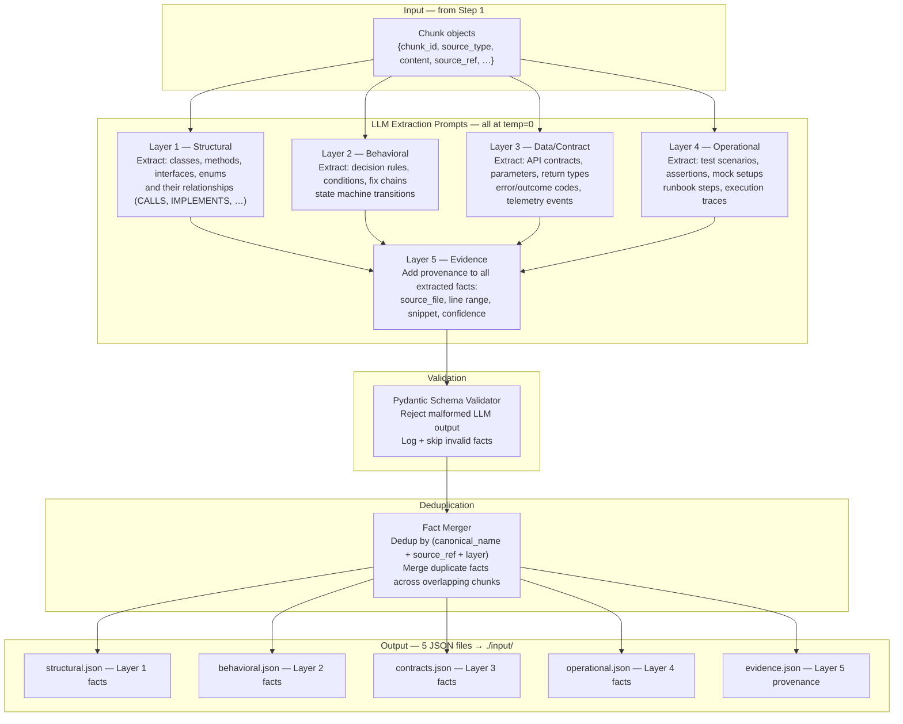

### 3.2 LLM Extraction Prompts

#### Layer 1 — Structural Extraction Prompt

```
System: You are a code structure extractor. Output only valid JSON. No prose.

User:
Extract ALL entities and their relationships from the following {language} code chunk.

For each entity (class, method, interface, enum, property, constant), output:
{
  "id": "<SHA-256[:16] of fully qualified name>",
  "canonical_name": "<fully qualified name — namespace.class.method>",
  "aliases": [],
  "kind": "<class|method|interface|enum|property|constant>",
  "source_type": "code",
  "source_ref": "{source_ref}",
  "source_line_start": <int>,
  "source_line_end": <int>,
  "layer": "<APILayer|PsdrCoreLayer|IOLayer|Shared or leave null>",
  "tags": ["public" | "private" | "internal" | "static" | "abstract" | "override"],
  "relations": [
    { "type": "<calls|implements|inherits|references|depends_on|part_of|emits|produces>",
      "target": "<fully qualified name of target entity>" }
  ],
  "confidence": "high"
}

Rules:
- Temperature: 0.0 — extract only what is explicitly present in the code.
- Do NOT infer relationships that are not directly visible in this chunk.
- If a target of a relation is not in this chunk, still emit the relation with the target name.
- Do NOT create entities for primitive types (string, int, bool, void).
- Output: a JSON array of entity objects. Nothing else.

Source file: {source_ref}
Lines: {start_line}–{end_line}
Language: {language}

```{language}
{chunk_content}
```
```

---

#### Layer 2 — Behavioral Extraction Prompt

```
System: You are a behavioral rule extractor. Output only valid JSON. No prose.

User:
Extract ALL decision rules, conditional branches, and state transitions from the following
{language} code chunk.

For each decision point (if/else, switch/case, try/catch, guard clause, policy check),
output:
{
  "id": "<SHA-256[:16] of owner_entity + condition>",
  "owner_entity": "<fully qualified name of the method/class that contains this rule>",
  "condition": "<verbatim condition expression>",
  "true_path": "<what happens when condition is true — 1 sentence>",
  "false_path": "<what happens when condition is false — 1 sentence>",
  "linked_outcome": "<outcome/error code set if condition is true or false, or null>",
  "linked_resolution": "<fix action or recovery step name, or null>",
  "source_ref": "{source_ref}",
  "source_line": <int — line of the condition>,
  "source_type": "code",
  "confidence": "high"
}

Rules:
- Only extract decisions that affect program flow or set an outcome code.
- Do NOT extract trivial null checks unless they set a named outcome.
- For switch statements, create one RuleFact per case.
- Output: a JSON array of rule objects. Nothing else.

Source file: {source_ref}
Lines: {start_line}–{end_line}

```{language}
{chunk_content}
```
```

---

#### Layer 3 — Data/Contract Extraction Prompt

```
System: You are an API contract extractor. Output only valid JSON. No prose.

User:
Extract ALL API contracts, data schemas, and outcome codes from the following {language}
code chunk.

For each public method, schema definition, or outcome-emitting operation, output:
{
  "id": "<SHA-256[:16] of entity_name>",
  "entity_name": "<fully qualified method or schema name>",
  "summary": "<doc comment or description — verbatim, or null>",
  "inputs": [
    { "name": "<param name>", "type": "<type>", "nullable": <bool>,
      "constraint": "<validation rule or null>", "description": "<or null>" }
  ],
  "outputs": [
    { "name": "<return field or response property>", "type": "<type>",
      "nullable": <bool>, "constraint": null, "description": "<or null>" }
  ],
  "outcome_codes": [
    { "value_name": "<e.g. ProblemId.Offline | HTTP 503 | Approved>",
      "meaning": "<1-sentence description>",
      "recoverable": <bool>,
      "severity": "<info|warning|error|critical>" }
  ],
  "preconditions": "<or null>",
  "postconditions": "<or null>",
  "source_ref": "{source_ref}",
  "source_line": <int>,
  "source_type": "code"
}

Rules:
- Only extract public or internal APIs (not private helpers).
- For enums used as outcome/status codes, create one ContractFact per enum member.
- Output: a JSON array. Nothing else.

Source file: {source_ref}

```{language}
{chunk_content}
```
```

---

#### Layer 4 — Operational Extraction Prompt

```
System: You are a test and operational trace extractor. Output only valid JSON. No prose.

User:
Extract ALL test scenarios, assertions, mock setups, and runbook steps from the following
{language} test file or runbook chunk.

For each test method or runbook step, output:
{
  "id": "<SHA-256[:16] of trace_name>",
  "trace_name": "<test method name or runbook step heading>",
  "scenario": "<what situation is being tested or executed — 1 sentence>",
  "action": "<what is called or performed>",
  "assertions": [
    { "what": "<what is being asserted>",
      "expected_value": "<expected outcome>",
      "check_method": "<Assert.Equal | FluentAssertions | manual check>" }
  ],
  "context_overrides": [
    { "dependency": "<mocked class or service>",
      "override_method": "<Mock.Setup | stub | env var override>",
      "return_value": "<what the mock returns>" }
  ],
  "implied_behavior": "<what real-world behavior this test proves — 1 sentence>",
  "covers_failure_path": <bool>,
  "source_ref": "{source_ref}",
  "source_line": <int>,
  "source_type": "code"
}

Rules:
- One OperationalFact per test method or runbook step.
- For data-driven tests ([Theory]/[InlineData]), create one fact per unique scenario variant.
- Output: a JSON array. Nothing else.

Source file: {source_ref}

```{language}
{chunk_content}
```
```

---

#### Layer 5 — Evidence (Provenance) Enrichment Prompt

```
System: You are a provenance tagger. Output only valid JSON. No prose.

User:
For each fact in the following JSON array, add provenance metadata.

For each fact, output the original object with these additional fields added:
{
  ... all original fields ...,
  "evidence": {
    "fact_id": "<same as the fact's id field>",
    "source_ref": "<file path or URL>",
    "source_line_start": <int>,
    "source_line_end": <int>,
    "source_snippet": "<verbatim 1-5 lines from the source — exact quote>",
    "confidence": "<high|medium|low>",
    "extraction_date": "<today's date ISO 8601>",
    "alternative_interpretations": "<other possible readings, or null>"
  }
}

Rules:
- source_snippet must be a verbatim quote from the source code — never paraphrase.
- confidence=high: unambiguous, direct evidence. medium: inferred. low: speculative.
- If you cannot find the source line, set source_line_start=null and confidence=low.
- Output: same JSON array with evidence field added to every object. Nothing else.

Facts to tag:
{json_array_of_facts}

Source file content (for snippet extraction):
{full_file_content}
```

---

### 3.3 Entity Resolution — After Extraction, Before Storage

Entity resolution runs after all 5 layers are extracted. It must complete before any graph or vector write.

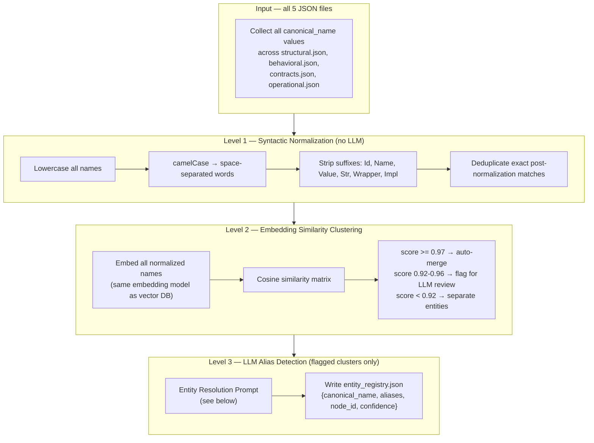

#### Entity Resolution Prompt

```
System: You are an entity resolution processor. Output only valid JSON. No prose.

User:
Below are groups of symbol names that may refer to the same concept.
For each group, decide if they are aliases for the same entity.

For each group that represents ONE concept, output:
{
  "canonical_name": "<most descriptive, most public name — prefer public API names>",
  "aliases": ["<all other names that mean the same thing>"],
  "evidence": ["<quote from code that proves they are the same, e.g. 'var sku = printer.ProductNumber'>"],
  "confidence": "high | medium | low",
  "alternatives": "<other possible interpretations if confidence is not high, or null>"
}

Rules:
- Only merge when you have code evidence (same variable passed, assignment, same comment).
- Do NOT merge based on semantic similarity alone — require code evidence.
- If confidence is low, still output the object but set confidence=low.
- If a group has only one name, output it as a singleton {canonical_name: ..., aliases: []}.
- Output: a JSON array of resolution objects. Nothing else.

Name groups to resolve:
{clustered_name_groups}
```

---

### 3.4 TRANSFORM Output — What Goes to the Next Steps

After extraction and resolution, `./input/` contains:

```
input/
├── structural.json    # EntityFact[] — goes to GRAPH (nodes + edges) and possibly VECTOR
├── behavioral.json    # RuleFact[]   — goes to BOTH Graph (CONTAINS edge) and VECTOR (BehavioralRule)
├── contracts.json     # ContractFact[] — goes to VECTOR (EntityContract) and GRAPH (RESOLVED_BY edges)
├── operational.json   # OperationalFact[] — goes to VECTOR (OperationalTrace) only
└── evidence.json      # EvidenceFact[] — becomes metadata on all vector documents
```

And `./output/entity_registry.json` is the canonical name authority for all subsequent steps.

### 3.5 Quality & Scoring Schema

After OpenKB compiles the wiki pages (Mode C), a **Quality & Scoring** gate evaluates every concept page before it is written to the Central Git Repository or the DBs. Pages that fail are logged and skipped — not deleted — so they can be retried after the source is improved.

| Check | What it validates | Pass threshold |
|---|---|---|
| Minimum length | Page must have substantive content | > 100 tokens |
| Source attribution | Must cite at least one source_ref | ≥ 1 source_ref |
| Completeness score | LLM-scored 0–1: does the page cover what/why/how? | ≥ 0.7 |
| Duplication check | Cosine similarity vs existing wiki pages | < 0.95 |
| Schema conformance | JSON frontmatter matches Metadata Service schema | 100% |

```
FUNCTION quality_score(wiki_page):

  IF token_count(wiki_page.content) < 100:
      RETURN { pass: False, reason: "too short" }

  IF wiki_page.source_refs is empty:
      RETURN { pass: False, reason: "no source attribution" }

  completeness = call_llm(completeness_prompt, wiki_page.content, temp=0.0)
  // prompt asks: does this page explain what the concept is, why it exists, how it works?
  IF completeness < 0.7:
      RETURN { pass: False, reason: "incomplete", score: completeness }

  similarity = max_cosine_similarity(wiki_page, existing_wiki_pages)
  IF similarity >= 0.95:
      RETURN { pass: False, reason: "near-duplicate" }

  IF NOT schema_valid(wiki_page.frontmatter):
      RETURN { pass: False, reason: "invalid frontmatter" }

  RETURN { pass: True, score: completeness }
```

Only pages with `pass: True` proceed to §3.6 Metadata Service and then to storage.

#### completeness_prompt — full text

```
System: You are a completeness evaluator for a technical knowledge base.
Output ONLY a JSON object with a single field: score. No prose.

User:
Rate the following page for completeness on a scale from 0.0 to 1.0.

Scoring rubric:
- 1.0  — Page clearly answers all three: WHAT (what is it?), WHY (why does it exist?), HOW (how does it work/how is it used?)
- 0.7  — Page clearly answers two of the three
- 0.4  — Page clearly answers only one
- 0.1  — Page is a stub, title only, or placeholder
- 0.0  — Empty or unrelated content

Output format: {"score": <float between 0.0 and 1.0>}

Page content:
{wiki_page_content}
```

---

### 3.6 Metadata Service — JSON Frontmatter

Every compiled wiki page and every stored artifact carries a **JSON frontmatter block** managed by the Metadata Service. This is the authoritative provenance record — it is what links a wiki page back to the Graph DB (via `graph_node_ids`) and to the Vector DB (via `source_ref` metadata).

#### Frontmatter Schema

```json
{
  "title": "string — canonical page title",
  "source_refs": ["array of source URLs or file paths"],
  "source_types": ["confluence | github | sharepoint | pdf | markdown"],
  "created_at": "ISO 8601",
  "updated_at": "ISO 8601",
  "version": "integer — increments on each update",
  "quality_score": "float 0.0–1.0",
  "tags": ["array of topic tags"],
  "entities_mentioned": ["canonical entity names found on this page"],
  "graph_node_ids": ["node IDs of Graph DB entities this page references"],
  "language": "string — primary content language",
  "confidentiality": "public | internal | restricted"
}
```

The `graph_node_ids` field is the same bridge mechanism used in vector documents — a wiki page in Git and a vector document in Chroma both reference the same Graph DB node via this field.

#### Metadata Service Responsibilities

| Responsibility | Detail |
|---|---|
| **Validate** | Ensure all required frontmatter fields are present before any write |
| **Stamp** | Auto-fill `created_at`, `updated_at`, `version` on create/update |
| **Link** | Resolve `entities_mentioned` → `graph_node_ids` using the entity registry |
| **Enforce schema** | Reject writes that don't match the schema (feeds back to Quality gate) |

---

## 4. Step 3 — GRAPH: Graph Hydration and Import

### 4.1 Overview

GRAPH takes the extraction JSON, resolves node IDs, builds typed edge triples, and writes them to Neo4j or Kùzu. This step produces the `graph_node_id` values that will be stamped on every vector document in Step 4.

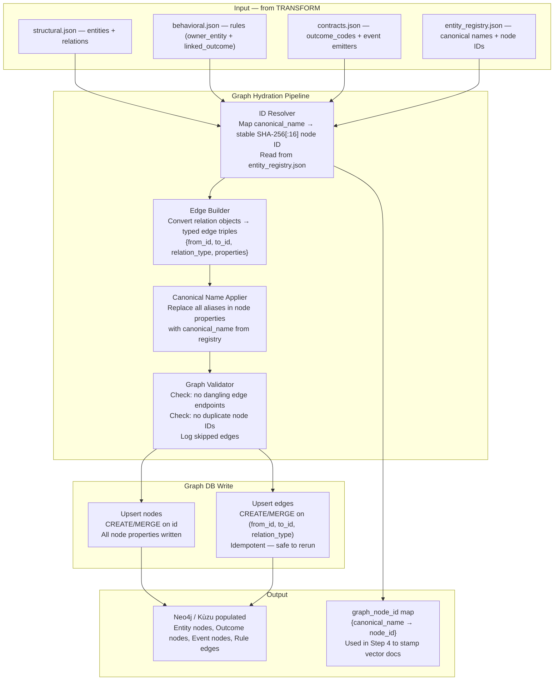

### 4.2 Graph DB Node Schema

| Node label | Key fields | Created from |
|---|---|---|
| `Entity` | `id`, `canonical_name`, `aliases[]`, `kind`, `source_type`, `source_ref` | structural.json |
| `Outcome` | `id`, `canonical_name`, `category`, `meaning`, `recoverable`, `severity` | contracts.json outcome_codes |
| `Event` | `id`, `canonical_name`, `event_type`, `trigger_condition`, `fields[]` | contracts.json telemetry |
| `Rule` | `id`, `condition`, `true_path`, `false_path`, `linked_outcome` | behavioral.json |

### 4.3 Graph DB Edge Vocabulary

| Edge type | From → To | Source |
|---|---|---|
| `CALLS` | Entity → Entity | structural.json relations |
| `IMPLEMENTS` | Entity → Entity | structural.json relations |
| `INHERITS` | Entity → Entity | structural.json relations |
| `REFERENCES` | Entity → Entity | structural.json / docs |
| `DEPENDS_ON` | Entity → Entity | structural.json relations |
| `PART_OF` | Entity → Entity | structural.json relations |
| `IS_ALIAS_OF` | Entity → Entity | entity_registry.json |
| `CONTAINS` | Entity → Rule | behavioral.json owner_entity |
| `EMITS` | Entity → Event | contracts.json telemetry |
| `PRODUCES` | Entity → Outcome | contracts.json outcome_codes |
| `RESOLVED_BY` | Outcome → Outcome | behavioral.json linked_resolution |
| `DETECTED_BY` | Outcome → Entity | behavioral.json linked diagnostics |
| `LEADS_TO` | Rule → Outcome | behavioral.json linked_outcome |

### 4.4 Graph Hydration Prompt

Run this prompt on batches of extraction JSON to produce import-ready node/edge triples:

```
System: You are a graph import processor. Output only valid JSON. No prose.

User:
Convert the following extracted facts into graph import format.

For each fact, produce:
{
  "nodes": [
    {
      "id": "<SHA-256[:16] of canonical_name — must be deterministic>",
      "label": "<Entity|Outcome|Event|Rule>",
      "properties": { "<all non-relation fields as key-value pairs>" }
    }
  ],
  "edges": [
    {
      "from": "<source node id>",
      "to": "<target node id>",
      "relation": "<CALLS|IMPLEMENTS|INHERITS|REFERENCES|DEPENDS_ON|PART_OF|IS_ALIAS_OF|CONTAINS|EMITS|PRODUCES|RESOLVED_BY|DETECTED_BY|LEADS_TO>",
      "properties": {
        "source_ref": "...",
        "source_line": 0,
        "confidence": "high|medium|low"
      }
    }
  ],
  "skipped_edges": [
    { "from": "...", "to_unresolved": "<name>", "reason": "target not in this batch" }
  ]
}

Rules:
- Node ID = SHA-256 of canonical_name, hex-encoded, first 16 characters.
- If target of a relation is not in this batch, emit the edge with to_unresolved=true and add to skipped_edges.
- Do not create nodes for primitive types.
- Output: { "nodes": [], "edges": [], "skipped_edges": [] }

Facts:
{json_array_from_structural_and_behavioral_and_contracts}
```

### 4.5 Cypher Queries for Graph Import

```cypher
-- Upsert an Entity node
MERGE (e:Entity {id: $id})
SET e.canonical_name = $canonical_name,
    e.aliases = $aliases,
    e.kind = $kind,
    e.source_type = $source_type,
    e.source_ref = $source_ref,
    e.tags = $tags,
    e.confidence = $confidence

-- Upsert a typed edge
MATCH (a {id: $from_id}), (b {id: $to_id})
MERGE (a)-[r:CALLS]->(b)
SET r.source_ref = $source_ref, r.confidence = $confidence

-- Query: what does MethodX call?
MATCH (:Entity {canonical_name: 'Namespace.Class.MethodX'})-[:CALLS]->(called)
RETURN called.canonical_name, called.kind, called.source_ref

-- Query: what fixes OutcomeY?
MATCH (:Outcome {canonical_name: 'ProblemId.PrinterOffline'})-[:RESOLVED_BY]->(fix)
RETURN fix.canonical_name, fix.source_ref

-- Query: N-hop impact trace
MATCH path = (:Entity {canonical_name: $start})-[:CALLS|EMITS|LEADS_TO*1..3]->(affected)
RETURN path, affected.canonical_name

-- Query: all alias nodes for a canonical
MATCH (alias)-[:IS_ALIAS_OF]->(canonical {canonical_name: 'ProductNumber'})
RETURN alias.canonical_name
```

### 4.6 Storage Layer — Complete Picture

The diagram's **Storage Layer** has four components, not two. The markdown previously covered Graph DB and Vector DB only. The full picture:

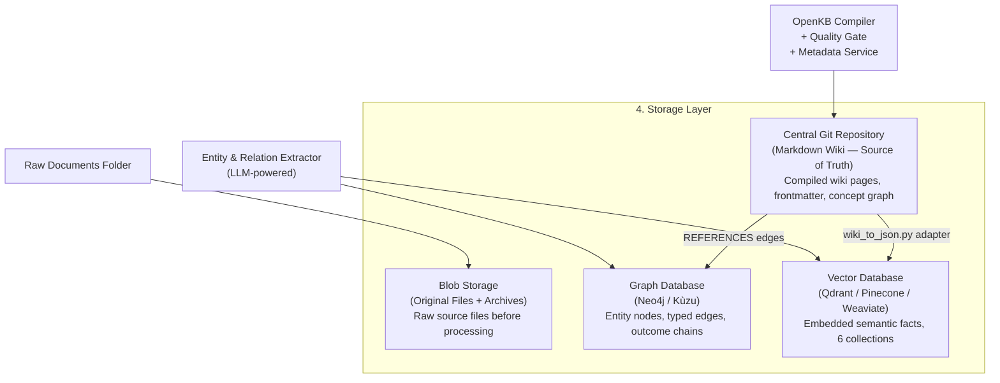

#### Central Git Repository — Source of Truth

| Property | Detail |
|---|---|
| **Content** | Compiled Markdown wiki pages with JSON frontmatter |
| **Structure** | `wiki/concepts/*.md` (cross-doc synthesis), `wiki/summaries/*.md` (per-source condensed) |
| **Role** | Single source of truth for human-readable knowledge — all other stores are derived from this |
| **Versioning** | Every update is a Git commit — full history, diff, blame |
| **Access** | Obsidian (human readers), wiki_to_json.py adapter (pipeline), Git hooks (CI triggers) |

```
// Git repository layout
wiki/
├── concepts/
│   ├── DiagnosticsEngine.md      // cross-doc synthesis: what it is, how it works
│   ├── PrinterOffline.md         // outcome code: meaning, recovery steps
│   └── SpoolerService.md         // service: dependencies, failure modes
└── summaries/
    ├── confluence-page-123.md    // per-source condensed version
    └── runbook-restart-spooler.md
```

#### Blob Storage — Raw File Archive

| Property | Detail |
|---|---|
| **Content** | Original unprocessed files — PDFs, `.docx`, HTML exports, raw `.cs`/`.cpp` snapshots |
| **Purpose** | Audit trail + re-processing source. If the pipeline needs to re-extract, it reads from Blob, not the live system |
| **Location** | `./raw_docs/archive/` locally; S3 / Azure Blob / GCS for team/production deployments |
| **Retention** | Keep all versions — do not overwrite; use `<filename>_<timestamp>.<ext>` naming |

#### Storage Write Order (critical)

```
FOR each compiled wiki page:
    1. Run Quality Gate (§3.5)                → stop if fail
    2. Metadata Service stamps frontmatter (§3.6)
    3. Git commit wiki page                   → Central Git Repository
    4. Archive original source file           → Blob Storage
    5. wiki_to_json.py adapter converts page  → chunk objects
    6. Entity & Relation Extractor runs       → structured JSON facts
    7. Write nodes + edges                    → Graph DB
    8. Embed + upsert                         → Vector DB
```

> **Rule:** Git is the source of truth. Graph DB and Vector DB are derived indexes. If they become inconsistent, re-run the pipeline from Git — not from the external sources.

---

## 5. Step 4 — RAG: Vector Embedding and Storage

### 5.1 Overview

RAG takes the extracted facts (L2–L5), enriches each one with aliases in the embedded text, attaches the `graph_node_id` from Step 3, embeds them using an embedding model, and stores them in collections in the Vector DB.

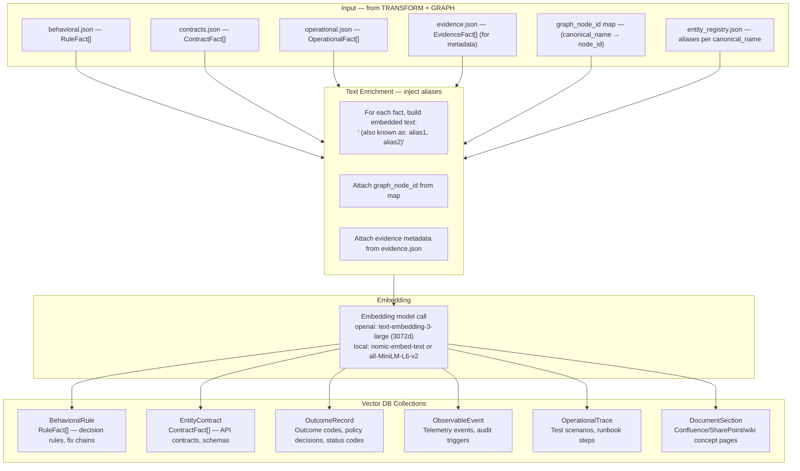

### 5.2 Vector Document Schema

Every document stored in the Vector DB follows this shape. The `graph_node_id` is the bridge to Step 3.

```json
{
  "id": "uuid-v4",
  "collection": "BehavioralRule | EntityContract | OutcomeRecord | ObservableEvent | OperationalTrace | DocumentSection",
  "text": "When ProductNumber (also known as: SKU, Model, product_number) is null, return ProblemId.PrinterNotFound (also: PrinterNotFound, PRINTER_NOT_FOUND)",
  "metadata": {
    "layer": 2,
    "kind": "rule",
    "source_type": "code",
    "entity_name": "Namespace.DiagnosticsEngine.RunCheck",
    "source_ref": "src/PsdrCoreLayer/Diagnostics/DiagnosticsEngine.cs",
    "source_line_start": 142,
    "source_line_end": 158,
    "confidence": "high",
    "graph_node_id": "a3f9c1d2e4b56780",
    "canonical_name": "ProductNumber",
    "aliases": ["SKU", "Model", "product_number"],
    "extraction_date": "2026-06-09"
  }
}
```

> **Critical:** The `text` field (what gets embedded) must contain ALL aliases. A query for "SKU" must hit the document that only uses "ProductNumber" in source code.

### 5.3 Layer → Collection Routing

| Fact type | Layer | Collection | Also in Graph? |
|---|---|---|---|
| Entity nodes + edges | L1 | ❌ not stored in vector | ✅ Graph only |
| Decision rules | L2 | `BehavioralRule` | ✅ CONTAINS edge |
| Outcome→resolution chains | L2 | `OutcomeRecord` | ✅ RESOLVED_BY edge |
| API contracts | L3 | `EntityContract` | ❌ vector only |
| Outcome codes | L3 | `OutcomeRecord` | ✅ LEADS_TO edge |
| Telemetry events | L3 | `ObservableEvent` | ✅ EMITS edge |
| Test traces / runbook steps | L4 | `OperationalTrace` | ❌ vector only |
| Confluence/wiki sections | L4 | `DocumentSection` | ✅ PART_OF / REFERENCES edge |
| Provenance | L5 | metadata fields on all docs | ❌ not a separate collection |

### 5.4 Embedding Model Options

| Model | Dimensions | Provider | Cost | Best for |
|---|---|---|---|---|
| `text-embedding-3-large` | 3072 | OpenAI (cloud) | ~$0.13 / 1M tokens | Highest quality, team/enterprise |
| `text-embedding-3-small` | 1536 | OpenAI (cloud) | ~$0.02 / 1M tokens | Good quality, lower cost |
| `nomic-embed-text` | 768 | Local (Ollama) | Free | Local dev, no API key needed |
| `all-MiniLM-L6-v2` | 384 | Local (sentence-transformers) | Free | Fastest local, lower quality |

### 5.5 Python Code — Upsert to Vector DB (Chroma example)

```python
# storage/vector_store.py — core upsert logic
import chromadb
from sentence_transformers import SentenceTransformer

client = chromadb.PersistentClient(path="./output/chroma")

def upsert_fact(fact: dict, collection_name: str, embedding_model):
    collection = client.get_or_create_collection(collection_name)

    # Build text with aliases injected
    aliases = fact["metadata"].get("aliases", [])
    alias_suffix = f" (also known as: {', '.join(aliases)})" if aliases else ""
    text = fact["text"] + alias_suffix

    embedding = embedding_model.encode(text).tolist()

    collection.upsert(
        ids=[fact["id"]],
        embeddings=[embedding],
        documents=[text],
        metadatas=[fact["metadata"]]
    )
```

---

## 6. Step 5 — AGENT: Query, Retrieval, and Answer Assembly

### 6.1 Overview

The AGENT step receives a natural language question and produces a grounded answer with citations by routing across Graph DB and Vector DB, merging results via the `graph_node_id` bridge, and passing ranked facts to an LLM for answer synthesis.

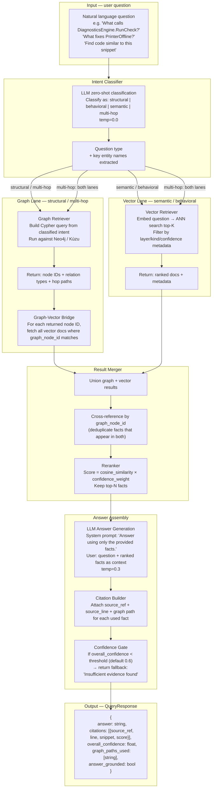

### 6.2 Intent Classifier Prompt

#### `IntentResult` and `PageResult` — type definitions

These are returned by `classifier.py` and `pagindex.py` respectively. Add them to `src/models/facts.py`.

```python
# Add to src/models/facts.py

class IntentResult(BaseModel):
    question_type: Literal["structural", "behavioral", "semantic", "multi-hop"]
    primary_entities: list[str]              # entity names extracted from the question
    requires_graph: bool
    requires_vector: bool
    cypher_hint: Optional[str] = None        # rough Cypher pattern, or None

class PageResult(BaseModel):
    primary_page: str                        # content of the best-matching wiki concept page
    child_pages: list[str] = []             # content of direct child concept pages
    source_refs: list[str] = []             # from frontmatter.source_refs
    graph_node_ids: list[str] = []          # from frontmatter.graph_node_ids
    confidence: float = 0.0                  # cosine similarity score of the best match
```

#### Intent Classifier Prompt — verbatim text
Classify the question and extract key entity names. Output only valid JSON. No prose.

User:
Classify the following question:

{
  "question_type": "<structural|behavioral|semantic|multi-hop>",
  "primary_entities": ["<entity names mentioned in the question>"],
  "requires_graph": <bool — true if the answer requires traversing relationships>,
  "requires_vector": <bool — true if the answer requires semantic similarity search>,
  "cypher_hint": "<rough Cypher pattern if structural, or null>"
}

Definitions:
- structural: "What calls X?", "Who implements Y?", "What inherits from Z?"
- behavioral: "What happens when X fails?", "What fixes Y?", "What does X do?"
- semantic: "Find code similar to...", "Which methods do X kind of thing?"
- multi-hop: "Trace the impact of X on Y", "How does A relate to B through the call chain?"

Question: "{question}"
```

### 6.3 Answer Assembly Prompt

```
System: You are a code knowledge base assistant. Answer questions using ONLY the provided
facts. Do not infer or add information not present in the facts. Cite every claim.

If the facts are insufficient to answer, say: "I don't have enough evidence to answer this
confidently. The closest facts I found are: [list them]."

User:
Question: {question}

Facts (ranked by relevance):
{ranked_facts_as_json_or_text}

Instructions:
- Answer in 2-5 sentences.
- After the answer, list: "Sources used:" with one bullet per cited fact showing
  source_ref, line numbers, and confidence.
- If a fact has a graph_path_used, include it as: "Graph path: A→B→C"
```

### 6.4 Query Routing Table

#### Reranker — scoring formula

Used in `src/agent/assembler.py` to rank the merged set of graph + vector + pagindex results before passing to the LLM.

```python
# src/agent/assembler.py

# confidence_weight maps string confidence level to a numeric multiplier
CONFIDENCE_WEIGHT = {"high": 1.0, "medium": 0.7, "low": 0.4}

def rerank(results: list[dict], query_vector: list[float]) -> list[dict]:
    """
    Score each result and return sorted list (highest first), capped at top-20.

    Score formula:
        score = cosine_similarity(result_vector, query_vector)
                × CONFIDENCE_WEIGHT[result.metadata.confidence]

    For graph results (no stored vector):
        cosine_similarity = 0.85  (fixed — graph hits are structurally exact)
        score = 0.85 × confidence_weight
    """
    for r in results:
        conf_w = CONFIDENCE_WEIGHT.get(r.get("confidence", "medium"), 0.7)
        if "distance" in r:                 # came from vector DB
            cos_sim = 1.0 - r["distance"]  # Chroma returns L2 distance; convert
            r["_score"] = cos_sim * conf_w
        else:                               # came from graph DB
            r["_score"] = 0.85 * conf_w
    return sorted(results, key=lambda x: x["_score"], reverse=True)[:20]


def compute_overall_confidence(results: list[dict]) -> float:
    """Mean score of top-5 results, clamped to [0, 1]."""
    top = results[:5]
    if not top:
        return 0.0
    return min(1.0, sum(r["_score"] for r in top) / len(top))
```
|---|---|---|---|
| "What calls `MethodX`?" | ✅ primary | ❌ | `MATCH (:Entity {canonical_name:'MethodX'})<-[:CALLS]-(m) RETURN m` |
| "Who implements `InterfaceY`?" | ✅ primary | ❌ | `MATCH (:Entity)-[:IMPLEMENTS]->(:Entity {canonical_name:'InterfaceY'}) RETURN *` |
| "What fixes `OutcomeZ`?" | ✅ primary | ✅ enrich | `MATCH (:Outcome {canonical_name:'Z'})-[:RESOLVED_BY]->(fix) RETURN fix` |
| "What happens when X fails?" | ❌ | ✅ primary | embed question → BehavioralRule + OutcomeRecord search |
| "Find code similar to this snippet" | ❌ | ✅ primary | embed snippet → ANN search across all collections |
| "Trace impact of A on B" | ✅ BFS | ✅ enrich | `MATCH path=(:Entity {name:'A'})-[:CALLS|EMITS*1..4]->(e) WHERE e.canonical_name='B' RETURN path` |
| "Which methods emit telemetry?" | ✅ primary | ❌ | `MATCH (m)-[:EMITS]->(t:Event) RETURN m, t` |
| "What does this Confluence page say about X?" | ❌ | ✅ DocumentSection | embed question → DocumentSection collection |

### 6.5 PageIndex Tree Reasoning Engine

The diagram shows a **third retrieval path** alongside GraphRAG and Vector Search: the **PageIndex Tree Reasoning Engine**. This is OpenKB's hierarchical concept index — it navigates the compiled wiki concept tree rather than running graph traversal or ANN search.

#### When PageIndex is used

| Question type | PageIndex better than… | Why |
|---|---|---|
| "Give me an overview of X" | Vector search | PageIndex returns the synthesised concept page, not individual fact fragments |
| "What are the sub-topics of X?" | Graph traversal | Concept hierarchy is explicit in the wiki tree, not encoded as graph edges |
| "Summarise everything about X" | ANN search | PageIndex retrieves the whole concept page at once rather than top-K fragments |
| "How is concept A related to concept B?" | Either | PageIndex cross-references (`entities_mentioned`) provide natural language links |

#### How PageIndex works

```
FUNCTION pagindex_retrieve(question, wiki_dir):

  // Step 1: Build concept tree from wiki/ directory
  concept_tree = load_wiki_concept_hierarchy(wiki_dir/concepts/)
  // tree structure = folder hierarchy + frontmatter parent/child tags

  // Step 2: Find best matching concept node
  query_embedding = embed(question)
  scored_nodes = []
  FOR each concept_page IN concept_tree:
      score = cosine_similarity(query_embedding, concept_page.title_embedding)
      scored_nodes.append((concept_page, score))
  best_match = max(scored_nodes, by=score)

  // Step 3: Return the full concept page + its direct children
  result = {
      primary_page:    best_match.content,
      child_pages:     [child.content FOR child IN best_match.children],
      source_refs:     best_match.frontmatter.source_refs,
      graph_node_ids:  best_match.frontmatter.graph_node_ids
  }
  RETURN result
  // graph_node_ids in the result are used to enrich with Graph DB facts
```

#### Updated Query Routing — Three Lanes

| Question pattern | GraphRAG lane | Vector lane | PageIndex lane |
|---|---|---|---|
| "What calls `MethodX`?" | ✅ primary | ❌ | ❌ |
| "What fixes `OutcomeZ`?" | ✅ primary | ✅ enrich | ❌ |
| "What happens when X fails?" | ❌ | ✅ primary | ❌ |
| "Give me an overview of X" | ❌ | ❌ | ✅ primary |
| "What are the sub-topics of diagnostics?" | ❌ | ❌ | ✅ primary |
| "Summarise the Confluence docs on X" | ❌ | ✅ DocumentSection | ✅ enrich |
| "Trace impact of A on B" | ✅ BFS | ✅ enrich | ❌ |

---

## 7. Python Libraries — Complete Manifest

### 7.1 Full `pyproject.toml`

```toml
[project]
name = "knowledge-base"
version = "0.1.0"
requires-python = ">=3.11"

dependencies = [
    # ── LLM Providers ───────────────────────────────────────────
    "openai>=1.30.0",                   # GPT-4o extraction + answer generation
    "anthropic>=0.25.0",                # Claude alternative
    "tiktoken>=0.7.0",                  # token counting for chunking budget

    # ── Orchestration ────────────────────────────────────────────
    "langchain>=0.2.0",                 # retriever chains, prompt templates
    "langchain-openai>=0.1.0",          # LangChain ↔ OpenAI connector
    "langchain-community>=0.2.0",       # Chroma/Weaviate LangChain integrations
    "llama-index>=0.10.0",              # alternative: KnowledgeGraphIndex + VectorIndex
    "llama-index-graph-stores-neo4j>=0.2.0",  # LlamaIndex ↔ Neo4j

    # ── Code Chunking ────────────────────────────────────────────
    "tree-sitter>=0.22.0",              # syntax-aware code parsing
    "tree-sitter-languages>=1.10.0",    # grammar pack: C#, C++, TS, Python, Go, Java, Rust

    # ── Schema Validation ────────────────────────────────────────
    "pydantic>=2.7.0",                  # validate LLM output against layer schemas
    "jsonschema>=4.22.0",               # alternative JSON Schema validation

    # ── Embeddings ───────────────────────────────────────────────
    "sentence-transformers>=3.0.0",     # local embeddings: nomic-embed-text, MiniLM
    "numpy>=1.26.0",                    # cosine similarity for entity resolution

    # ── Vector DB ────────────────────────────────────────────────
    "chromadb>=0.5.0",                  # local/Docker vector DB (default for dev)
    "weaviate-client>=4.6.0",           # Weaviate cloud/self-hosted (team option)
    "pinecone-client>=3.0.0",           # Pinecone managed cloud (enterprise option)
    "qdrant-client>=1.9.0",             # Qdrant self-hosted (metadata filtering)

    # ── Graph DB ─────────────────────────────────────────────────
    "neo4j>=5.20.0",                    # Neo4j Bolt driver (primary graph DB)
    "kuzu>=0.4.0",                      # Kùzu embedded graph DB (local/CI option)

    # ── API + Serving ────────────────────────────────────────────
    "fastapi>=0.111.0",                 # REST API for /query, /health, /stats
    "uvicorn[standard]>=0.29.0",        # ASGI server for FastAPI
    "mcp>=1.0.0",                       # Model Context Protocol SDK (VS Code integration)

    # ── Document Pre-processing (OpenKB — optional) ──────────────
    "openkb>=0.3.0",                    # VectifyAI: wiki compiler + PageIndex + Skill Factory

    # ── CLI ──────────────────────────────────────────────────────
    "click>=8.1.0",                     # CLI framework
    "rich>=13.7.0",                     # terminal output formatting

    # ── Utilities ────────────────────────────────────────────────
    "httpx>=0.27.0",                    # async HTTP client
    "tenacity>=8.3.0",                  # retry + exponential backoff for LLM calls
    "python-dotenv>=1.0.0",             # load .env config
    "python-slugify>=8.0.0",            # canonical name normalisation
    "scikit-learn>=1.4.0",              # cosine similarity clustering (entity resolution L2)
]

[project.scripts]
kb = "cli:main"

[tool.pytest.ini_options]
testpaths = ["tests"]
asyncio_mode = "auto"

[tool.ruff]
line-length = 100
```

### 7.2 Library Purpose Map

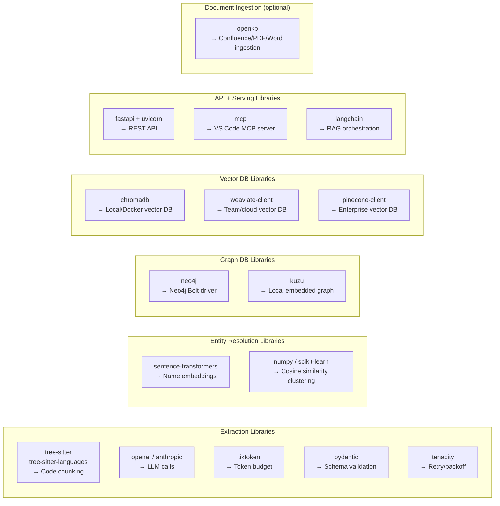

### 7.3 Install Commands

```bash
# Create virtual environment
python -m venv .venv
source .venv/bin/activate       # Linux/Mac
.venv\Scripts\activate          # Windows PowerShell

# Install all dependencies
pip install -e .

# Install with optional extras
pip install -e ".[dev]"         # includes pytest, ruff, mypy

# Verify key installs
python -c "import openai; print(openai.__version__)"
python -c "import chromadb; print(chromadb.__version__)"
python -c "import neo4j; print(neo4j.__version__)"
python -c "import tree_sitter; print(tree_sitter.__version__)"

# Install Ollama for local embeddings (optional)
# https://ollama.ai — then:
ollama pull nomic-embed-text
```

---

## 8. Deployment — Graph DB, Vector DB, API Server

### 8.1 Docker Compose (Full Stack)

```yaml
# docker-compose.yml
version: "3.9"

services:

  # ── Neo4j — Graph DB ───────────────────────────────────────────
  neo4j:
    image: neo4j:5.20-community
    container_name: kb-neo4j
    ports:
      - "7474:7474"    # Neo4j Browser UI
      - "7687:7687"    # Bolt protocol (Python driver)
    environment:
      NEO4J_AUTH: neo4j/password
      NEO4J_PLUGINS: '["apoc"]'           # APOC for graph algorithms (optional)
      NEO4J_dbms_memory_pagecache_size: 1G
      NEO4J_dbms_memory_heap_max__size: 2G
    volumes:
      - neo4j_data:/data
      - neo4j_logs:/logs
    healthcheck:
      test: ["CMD", "cypher-shell", "-u", "neo4j", "-p", "password", "RETURN 1"]
      interval: 30s
      timeout: 10s
      retries: 5

  # ── Chroma — Vector DB ─────────────────────────────────────────
  chroma:
    image: chromadb/chroma:0.5.0
    container_name: kb-chroma
    ports:
      - "8001:8000"    # Chroma REST API
    environment:
      CHROMA_SERVER_AUTH_CREDENTIALS_PROVIDER: ""   # no auth for local dev
    volumes:
      - chroma_data:/chroma/chroma
    healthcheck:
      test: ["CMD", "curl", "-f", "http://localhost:8000/api/v1/heartbeat"]
      interval: 30s
      timeout: 5s
      retries: 3

  # ── Knowledge Base API ─────────────────────────────────────────
  kb-api:
    build: .
    container_name: kb-api
    ports:
      - "8000:8000"
    environment:
      - OPENAI_API_KEY=${OPENAI_API_KEY}
      - NEO4J_URI=bolt://neo4j:7687
      - NEO4J_USER=neo4j
      - NEO4J_PASSWORD=password
      - VECTOR_BACKEND=chroma
      - CHROMA_PATH=http://chroma:8000
      - GRAPH_BACKEND=neo4j
    depends_on:
      neo4j:
        condition: service_healthy
      chroma:
        condition: service_healthy
    command: uvicorn api.main:app --host 0.0.0.0 --port 8000

  # ── Optional: Weaviate (replace Chroma for team/enterprise) ────
  # weaviate:
  #   image: semitechnologies/weaviate:1.25.0
  #   ports:
  #     - "8080:8080"
  #   environment:
  #     QUERY_DEFAULTS_LIMIT: 25
  #     AUTHENTICATION_ANONYMOUS_ACCESS_ENABLED: "true"
  #     DEFAULT_VECTORIZER_MODULE: none

volumes:
  neo4j_data:
  neo4j_logs:
  chroma_data:
```

### 8.2 Neo4j Deployment Steps

```bash
# Option A: Docker (recommended for dev/local)
docker compose up neo4j -d

# Wait for health check
docker compose ps
# Expected: kb-neo4j   Up   7474/tcp, 7687/tcp

# Open Neo4j Browser
# Navigate to: http://localhost:7474
# Login: neo4j / password

# Verify connection from Python
python -c "
from neo4j import GraphDatabase
driver = GraphDatabase.driver('bolt://localhost:7687', auth=('neo4j','password'))
with driver.session() as s:
    result = s.run('RETURN 1 AS n')
    print(result.single()['n'])  # should print: 1
"

# Create initial schema constraints and indexes
python -c "
from neo4j import GraphDatabase
driver = GraphDatabase.driver('bolt://localhost:7687', auth=('neo4j','password'))
with driver.session() as s:
    # Uniqueness constraint on Entity id
    s.run('CREATE CONSTRAINT entity_id IF NOT EXISTS FOR (e:Entity) REQUIRE e.id IS UNIQUE')
    # Index on canonical_name for fast lookup
    s.run('CREATE INDEX entity_name IF NOT EXISTS FOR (e:Entity) ON (e.canonical_name)')
    # Fulltext index on aliases array
    s.run(\"CREATE FULLTEXT INDEX entity_aliases IF NOT EXISTS FOR (e:Entity) ON EACH [e.canonical_name, e.aliases]\")
    print('Schema constraints and indexes created')
"

# Option B: Neo4j Aura (cloud — for team/enterprise)
# 1. Create account at: https://neo4j.com/cloud/platform/aura-graph-database/
# 2. Create a new AuraDB Free or Professional instance
# 3. Download the connection credentials (URI, username, password)
# 4. Update .env:
#    NEO4J_URI=neo4j+s://<your-aura-instance>.databases.neo4j.io
#    NEO4J_USER=neo4j
#    NEO4J_PASSWORD=<aura-password>
```

### 8.3 Chroma Deployment Steps

```bash
# Option A: Docker (local dev)
docker compose up chroma -d

# Verify
curl http://localhost:8001/api/v1/heartbeat
# Expected: {"nanosecond heartbeat": <timestamp>}

# Option B: Persistent local (no Docker)
pip install chromadb
python -c "
import chromadb
client = chromadb.PersistentClient(path='./output/chroma')
print(client.heartbeat())  # should return timestamp
"

# Option C: Chroma Cloud (managed)
# 1. Sign up at: https://trychroma.com
# 2. Get API key
# 3. pip install chromadb
# 4. Update .env:
#    CHROMA_API_KEY=<your-key>
#    CHROMA_TENANT=<your-tenant>
#    CHROMA_DATABASE=<your-db>
```

### 8.4 Weaviate Deployment Steps (Alternative to Chroma)

```bash
# Option A: Docker
docker run -d \
  -p 8080:8080 \
  -e QUERY_DEFAULTS_LIMIT=25 \
  -e AUTHENTICATION_ANONYMOUS_ACCESS_ENABLED=true \
  -e DEFAULT_VECTORIZER_MODULE=none \
  --name kb-weaviate \
  semitechnologies/weaviate:1.25.0

# Verify
curl http://localhost:8080/v1/.well-known/ready
# Expected: {}

# Create collections from Python
python -c "
import weaviate
client = weaviate.connect_to_local()
client.collections.create('BehavioralRule')
client.collections.create('EntityContract')
client.collections.create('OutcomeRecord')
client.collections.create('ObservableEvent')
client.collections.create('OperationalTrace')
client.collections.create('DocumentSection')
print('Collections created')
client.close()
"

# Option B: Weaviate Cloud (managed)
# 1. Sign up at: https://console.weaviate.cloud
# 2. Create a serverless cluster (free tier available)
# 3. pip install weaviate-client
# 4. Update .env:
#    WEAVIATE_URL=https://<cluster>.weaviate.network
#    WEAVIATE_API_KEY=<your-key>
```

### 8.5 API Server Deployment Steps

```bash
# Local development
uvicorn api.main:app --reload --host 0.0.0.0 --port 8000

# MCP server for VS Code Copilot
kb mcp --port 3000

# Production with Docker
docker compose up kb-api -d

# Full stack
docker compose up -d
docker compose logs -f kb-api
```

### 8.6 VS Code MCP Integration

```json
// .vscode/mcp.json  — add this to the repo
{
  "servers": {
    "knowledge-base": {
      "type": "stdio",
      "command": "kb",
      "args": ["mcp"],
      "env": {
        "OPENAI_API_KEY": "${env:OPENAI_API_KEY}"
      }
    }
  }
}
```

---

## 9. Bootstrap Sequence — Full End-to-End Run

### 9.1 First-Time Setup

```mermaid
sequenceDiagram
    autonumber
    participant DEV as Developer
    participant INFRA as Infrastructure
    participant PIPELINE as Pipeline
    participant GDB2 as Graph DB
    participant VDB2 as Vector DB
    participant API as API Server

    DEV->>INFRA: docker compose up neo4j chroma -d
    INFRA-->>DEV: Neo4j on :7687, Chroma on :8001

    DEV->>INFRA: python -m venv .venv; pip install -e .
    INFRA-->>DEV: all Python packages installed

    DEV->>INFRA: cp .env.example .env; set API keys + DB URIs
    INFRA-->>DEV: .env ready

    DEV->>GDB2: python scripts/create_schema.py
    GDB2-->>DEV: constraints and indexes created

    DEV->>PIPELINE: kb extract --input-dir ./src --output-dir ./input --language csharp
    Note over PIPELINE: Walks ./src, chunks with tree-sitter,<br/>runs 5-layer LLM prompts, validates JSON
    PIPELINE-->>DEV: ./input/structural.json + behavioral.json + contracts.json + operational.json + evidence.json

    DEV->>PIPELINE: kb resolve --input-dir ./input --output-dir ./output
    Note over PIPELINE: Entity resolution: normalize + embed + cluster + LLM alias detection
    PIPELINE-->>DEV: ./output/entity_registry.json

    DEV->>PIPELINE: kb hydrate --input-dir ./input --registry ./output/entity_registry.json
    Note over PIPELINE: ID resolution, edge building, canonical name application
    PIPELINE-->>DEV: ./output/graph_triples.json

    DEV->>GDB2: kb import --input-dir ./output --graph neo4j
    GDB2-->>DEV: nodes and edges written

    DEV->>VDB2: kb import --input-dir ./input --vector chroma
    Note over VDB2: Embed facts with alias injection, upsert to collections
    VDB2-->>DEV: all collections populated

    DEV->>API: kb serve --host 0.0.0.0 --port 8000
    API-->>DEV: API ready at http://localhost:8000

    DEV->>API: kb query --question "What fixes PrinterOffline?"
    API-->>DEV: answer + citations
```

### 9.2 CLI Commands — Full Reference

```bash
# ─── Step 1: INPUT ────────────────────────────────────────────────
# Walk source directory and chunk with tree-sitter
kb extract \
  --input-dir ./src \
  --output-dir ./input \
  --language csharp \
  --layers all \
  --chunk-size-tokens 1500 \
  --repo-root ./src

# Document sources via OpenKB (Mode C)
openkb add ./docs/                           # ingest all docs in ./docs/
openkb add https://confluence.example.com/page  # ingest a URL
openkb watch ./docs/                         # watch for changes (CI mode)
kb openkb load --wiki-dir ./wiki --output-dir ./input  # convert wiki → JSON

# ─── Step 2: TRANSFORM ───────────────────────────────────────────
# Entity resolution (run after extract, before hydrate)
kb resolve \
  --input-dir ./input \
  --output-dir ./output \
  --threshold 0.92

# ─── Step 3: GRAPH ────────────────────────────────────────────────
# Graph hydration (convert relations to import-ready triples)
kb hydrate \
  --input-dir ./input \
  --registry ./output/entity_registry.json \
  --output-dir ./output

# Import to graph DB
kb import \
  --input-dir ./output \
  --graph neo4j

# ─── Step 4: RAG ──────────────────────────────────────────────────
# Embed and import to vector DB
kb import \
  --input-dir ./input \
  --vector chroma

# ─── Step 5: AGENT ────────────────────────────────────────────────
# Start REST API
kb serve --host 0.0.0.0 --port 8000

# Start MCP server (VS Code Copilot)
kb mcp --port 3000

# Run a query from CLI
kb query --question "What calls DiagnosticsEngine.RunCheck?" --top-k 10

# ─── Full pipeline in one command ─────────────────────────────────
kb pipeline \
  --input-dir ./src \
  --language csharp \
  --graph neo4j \
  --vector chroma \
  --serve
```

### 9.3 Re-Run Strategy (Incremental Updates)

| Change type | Command | Scope |
|---|---|---|
| New/modified source files | `kb extract --files path/to/changed.cs` | Extract only changed files |
| New doc added to `./docs/` | `openkb watch` (auto) or `openkb add ./docs/new.pdf` | OpenKB re-compiles wiki |
| Entity registry needs refresh | `kb resolve --input-dir ./input` | Re-runs resolution |
| Graph schema change | `kb hydrate && kb import --graph neo4j` | Re-hydrates + re-imports |
| Full re-index | `kb pipeline --input-dir ./src` | End-to-end |

---

## 10. Data Contracts — JSON Schemas at Each Hand-off

These are the exact shapes produced at each pipeline boundary. Every downstream component depends on these schemas being valid.

### 10.1 Chunk (INPUT → TRANSFORM)

```json
{
  "chunk_id": "a3f9c1d2",
  "source_type": "code",
  "source_ref": "src/PsdrCoreLayer/Diagnostics/DiagnosticsEngine.cs",
  "source_line_start": 142,
  "source_line_end": 178,
  "language": "csharp",
  "content": "public DiagnosticResult RunCheck(PrinterContext context) { ... }",
  "estimated_tokens": 312
}
```

### 10.2 EntityFact — structural.json (TRANSFORM → GRAPH)

```json
{
  "id": "a3f9c1d2e4b56780",
  "canonical_name": "PsdrCoreLayer.Diagnostics.DiagnosticsEngine.RunCheck",
  "aliases": [],
  "kind": "method",
  "source_type": "code",
  "source_ref": "src/PsdrCoreLayer/Diagnostics/DiagnosticsEngine.cs",
  "source_line_start": 142,
  "source_line_end": 178,
  "layer": "PsdrCoreLayer",
  "tags": ["public", "entry-point"],
  "relations": [
    { "type": "calls", "target": "PsdrCoreLayer.Diagnostics.CheckSpooler.Run" },
    { "type": "produces", "target": "ProblemId.SpoolerStopped" }
  ],
  "confidence": "high"
}
```

### 10.3 RuleFact — behavioral.json (TRANSFORM → GRAPH + VECTOR)

```json
{
  "id": "b8e2f4a1c9d3",
  "owner_entity": "PsdrCoreLayer.Diagnostics.DiagnosticsEngine.RunCheck",
  "condition": "context.SpoolerStatus == ServiceStatus.Stopped",
  "true_path": "Sets outcome to ProblemId.SpoolerStopped and triggers RestartSpooler fix",
  "false_path": "Continues to next diagnostic check",
  "linked_outcome": "ProblemId.SpoolerStopped",
  "linked_resolution": "FixActionId.RestartSpooler",
  "source_ref": "src/PsdrCoreLayer/Diagnostics/DiagnosticsEngine.cs",
  "source_line": 156,
  "source_type": "code",
  "confidence": "high"
}
```

### 10.4 Graph Triple (GRAPH hydration output)

```json
{
  "nodes": [
    {
      "id": "a3f9c1d2e4b56780",
      "label": "Entity",
      "properties": {
        "canonical_name": "PsdrCoreLayer.Diagnostics.DiagnosticsEngine.RunCheck",
        "kind": "method",
        "source_type": "code",
        "source_ref": "src/PsdrCoreLayer/Diagnostics/DiagnosticsEngine.cs",
        "tags": ["public"]
      }
    }
  ],
  "edges": [
    {
      "from": "a3f9c1d2e4b56780",
      "to": "c7d4e8f2b1a9",
      "relation": "CALLS",
      "properties": { "source_ref": "DiagnosticsEngine.cs", "source_line": 163, "confidence": "high" }
    }
  ],
  "skipped_edges": []
}
```

### 10.5 Vector Document (TRANSFORM → VECTOR — after alias injection)

```json
{
  "id": "vec-b8e2f4a1c9d3",
  "collection": "BehavioralRule",
  "text": "When context.SpoolerStatus equals ServiceStatus.Stopped (also known as: SpoolerStopped, spooler_stopped), sets outcome to ProblemId.SpoolerStopped (also known as: SpoolerError, SPOOLER_STOPPED) and triggers RestartSpooler fix",
  "metadata": {
    "layer": 2,
    "kind": "rule",
    "source_type": "code",
    "entity_name": "PsdrCoreLayer.Diagnostics.DiagnosticsEngine.RunCheck",
    "source_ref": "src/PsdrCoreLayer/Diagnostics/DiagnosticsEngine.cs",
    "source_line_start": 156,
    "source_line_end": 161,
    "confidence": "high",
    "graph_node_id": "a3f9c1d2e4b56780",
    "canonical_name": "DiagnosticsEngine.RunCheck",
    "aliases": ["RunDiagnostics", "ExecuteCheck"],
    "extraction_date": "2026-06-09"
  }
}
```

### 10.6 QueryResponse (AGENT output)

```json
{
  "answer": "When the spooler service is stopped, DiagnosticsEngine.RunCheck sets the outcome to ProblemId.SpoolerStopped and triggers the RestartSpooler fix action via the RESOLVED_BY graph edge.",
  "citations": [
    {
      "fact_id": "b8e2f4a1c9d3",
      "source_ref": "src/PsdrCoreLayer/Diagnostics/DiagnosticsEngine.cs",
      "start_line": 156,
      "end_line": 161,
      "snippet": "if (context.SpoolerStatus == ServiceStatus.Stopped) { outcome = ProblemId.SpoolerStopped; }",
      "relevance_score": 0.94,
      "confidence": "high"
    }
  ],
  "overall_confidence": 0.91,
  "graph_paths_used": ["DiagnosticsEngine.RunCheck -[PRODUCES]-> ProblemId.SpoolerStopped -[RESOLVED_BY]-> FixActionId.RestartSpooler"],
  "answer_grounded": true
}
```

---

## 11. INPUT → TRANSFORM → Storage: Pseudocode Guide

This section explains the methods, the storage writes, the sentence transformer choice, and partial update logic — in pseudocode so the flow is clear without implementation noise.

---

### 11.1 INPUT → TRANSFORM: How Data Flows

```
FUNCTION run_pipeline(source_dir, output_dir, language):

  // ── Step 1: Collect files ──────────────────────────────────────
  source_files = walk_directory(source_dir, extensions=[".cs",".cpp",".ts"])
                 excluding test files, bin/, obj/, node_modules/
  test_files   = walk_directory(source_dir)
                 including only files with "test" in name or path

  // ── Step 2: Chunk each file ────────────────────────────────────
  FOR each file IN source_files:
      chunks = split_file_at_class_and_method_boundaries(file, max_tokens=1500)
      // tree-sitter parses the AST → finds class_declaration / method_declaration nodes
      // each node becomes one chunk, including its doc comment
      // if a node is too large → recurse into its children

  FOR each file IN test_files:
      test_chunks = split_file_at_test_method_boundaries(file, max_tokens=1500)

  // ── Step 3: Extract facts via LLM (temp=0) ────────────────────
  FOR each chunk IN all_chunks:
      FOR layer IN [1, 2, 3]:   // Layer 4 uses test_chunks only
          raw_json = call_llm(layer_prompt[layer], chunk.content, temp=0.0)
          facts    = parse_and_validate_json(raw_json, layer_schema[layer])
          // if validation fails → log and skip that fact, don't crash
          accumulate facts into facts_by_layer[layer]

  FOR each chunk IN test_chunks:
      raw_json = call_llm(layer4_prompt, chunk.content, temp=0.0)
      facts    = parse_and_validate_json(raw_json, layer4_schema)
      accumulate into facts_by_layer[4]

  // ── Step 4: Add provenance (Layer 5) ──────────────────────────
  FOR each fact IN all_facts:
      enriched_fact = call_llm(layer5_prompt, fact + original_file_content, temp=0.0)
      // adds source_snippet (verbatim quote) + confidence + extraction_date

  // ── Step 5: Deduplicate ────────────────────────────────────────
  FOR each layer:
      remove duplicates by fact.id
      when same id appears twice → keep the one with more non-null fields

  // ── Step 6: Write output ───────────────────────────────────────
  write_json(facts_by_layer[1], output_dir/structural.json)
  write_json(facts_by_layer[2], output_dir/behavioral.json)
  write_json(facts_by_layer[3], output_dir/contracts.json)
  write_json(facts_by_layer[4], output_dir/operational.json)
  write_json(enriched_facts,    output_dir/evidence.json)
```

---

### 11.2 Entity Resolution: Before Writing to Any DB

```
FUNCTION resolve_entities(input_dir, output_dir):

  // Collect all canonical_name values from all 5 JSON files
  names = collect_all_entity_names(input_dir/*.json)

  // ── Level 1: Syntactic normalization (no LLM) ─────────────────
  FOR each name IN names:
      normalized = lowercase(name)
      normalized = camel_case_to_words(normalized)     // "RunCheck" → "run check"
      normalized = strip_suffixes(normalized,           // remove Id, Name, Wrapper, Impl
                   ["id", "name", "value", "wrapper", "impl", "str"])
  deduplicate exact matches after normalization

  // ── Level 2: Embedding similarity clustering ───────────────────
  embeddings = embed_all(normalized_names)              // same model as vector DB
  similarity_matrix = cosine_similarity(embeddings)

  FOR each pair (A, B) with similarity >= 0.97:
      auto_merge(A, B)          // keep most public/descriptive name as canonical

  FOR each pair (A, B) with 0.92 <= similarity < 0.97:
      flag_for_llm_review(A, B)

  // ── Level 3: LLM alias detection (flagged clusters only) ───────
  FOR each flagged cluster:
      result = call_llm(entity_resolution_prompt, cluster_names, temp=0.0)
      // LLM decides: are these the same entity? if yes → which is canonical?
      // only merges when code evidence exists (same variable, assignment, comment)

  // ── Write registry ─────────────────────────────────────────────
  write_json(entity_registry, output_dir/entity_registry.json)
  // registry = [{ canonical_name, aliases[], node_id, confidence }]
```

---

### 11.3 Writing to Graph DB: Pseudocode

```
FUNCTION write_to_graph_db(input_dir, registry, graph_client):

  structural = load_json(input_dir/structural.json)   // EntityFact[]
  behavioral = load_json(input_dir/behavioral.json)   // RuleFact[]
  contracts  = load_json(input_dir/contracts.json)    // ContractFact[]

  // ── Step 1: Resolve node IDs ───────────────────────────────────
  FOR each fact IN structural + behavioral + contracts:
      fact.node_id = registry.lookup(fact.canonical_name)
      // node_id = SHA-256[:16] of canonical_name — stable and deterministic

  // ── Step 2: Upsert Entity nodes ────────────────────────────────
  FOR each entity IN structural:
      graph_client.MERGE node (Entity {id: entity.node_id})
      SET  canonical_name, aliases, kind, source_type, source_ref, tags
      // MERGE = insert if not exists, update if exists → idempotent

  // ── Step 3: Upsert Outcome nodes (from contracts.outcome_codes) ─
  FOR each contract IN contracts:
      FOR each outcome IN contract.outcome_codes:
          graph_client.MERGE node (Outcome {id: hash(outcome.value_name)})
          SET  canonical_name, meaning, recoverable, severity

  // ── Step 4: Upsert typed edges ─────────────────────────────────
  FOR each entity IN structural:
      FOR each relation IN entity.relations:
          target_id = registry.lookup(relation.target)
          IF target_id exists:
              graph_client.MERGE edge (entity.node_id)-[relation.type]->(target_id)
              SET  source_ref, source_line, confidence
          ELSE:
              log "skipped edge: target not yet in graph"

  // ── Step 5: Add Rule edges from behavioral ─────────────────────
  FOR each rule IN behavioral:
      owner_id   = registry.lookup(rule.owner_entity)
      outcome_id = registry.lookup(rule.linked_outcome)  // if present
      graph_client.MERGE edge (owner_id)-[:CONTAINS]->(rule.node_id)
      IF outcome_id:
          graph_client.MERGE edge (rule.node_id)-[:LEADS_TO]->(outcome_id)

  // ── Step 6: Return graph_node_id map ───────────────────────────
  RETURN { canonical_name → node_id }   // used by RAG step to stamp vector docs
```

#### Key point: MERGE = idempotent upsert

```
// MERGE behaviour in Neo4j / Cypher:
//   IF node with {id} exists  → update properties (SET)
//   IF node does not exist    → create it
// Same for edges: MERGE on (from_id, to_id, relation_type)
// → safe to run multiple times, no duplicates created
```

#### Node ID generation — exact algorithm

```python
import hashlib

def make_node_id(canonical_name: str) -> str:
    """
    Deterministic node_id: SHA-256 of canonical_name, first 16 hex characters.

    Rules:
    - Keep ORIGINAL CASING — do NOT lowercase ('RunCheck' != 'runcheck')
    - Strip leading/trailing whitespace only
    - Encode as UTF-8 before hashing
    - Take first 16 characters of the hex digest

    Example:
        make_node_id('PsdrCoreLayer.Diagnostics.DiagnosticsEngine.RunCheck')
        → 'a3f9c1d2e4b56780'  (16 hex chars)
    """
    return hashlib.sha256(canonical_name.strip().encode("utf-8")).hexdigest()[:16]
```

> **Critical:** Always call `make_node_id()` with the **canonical_name** from the entity registry — never with an alias. Aliases resolve to the same `node_id` via `EntityRegistry.lookup()` (see §13), but the ID itself is derived only from the canonical form.

---

### 11.4 Writing to Vector DB: Pseudocode

#### Which Sentence Transformer to Use

| Use case | Model | Dimensions | Notes |
|---|---|---|---|
| **Default / best quality** | `text-embedding-3-large` (OpenAI) | 3072 | Use when you have an API key; highest retrieval accuracy |
| **Cost-efficient cloud** | `text-embedding-3-small` (OpenAI) | 1536 | ~6× cheaper, still good quality |
| **Local dev (no API key)** | `nomic-embed-text` (Ollama) | 768 | Run with `ollama pull nomic-embed-text`; free; good quality |
| **Fastest local** | `all-MiniLM-L6-v2` (sentence-transformers) | 384 | `pip install sentence-transformers`; lowest quality but instant |
| **Best local quality** | `BAAI/bge-large-en-v1.5` (sentence-transformers) | 1024 | Better than MiniLM; no API key needed |

> **Rule:** Use the **same model for embedding at ingest time AND at query time**. Never mix models. The vector space is model-specific — a query embedded with model A will not retrieve correctly from vectors embedded with model B.

```
FUNCTION write_to_vector_db(input_dir, graph_node_id_map, registry, vector_client, embed_model):

  behavioral = load_json(input_dir/behavioral.json)
  contracts  = load_json(input_dir/contracts.json)
  operational= load_json(input_dir/operational.json)
  evidence   = load_json(input_dir/evidence.json)   // provenance metadata

  // Build evidence lookup: fact_id → evidence metadata
  evidence_map = { e.fact_id: e FOR e IN evidence }

  FOR each fact IN behavioral + contracts + operational:

      // ── Step 1: Determine which collection this fact goes into ─
      collection = route_to_collection(fact)
      //   RuleFact        → "BehavioralRule"
      //   ContractFact    → "EntityContract"
      //   OutcomeSpec     → "OutcomeRecord"
      //   EventSpec       → "ObservableEvent"
      //   OperationalFact → "OperationalTrace"

      // ── Step 2: Build the text to embed ───────────────────────
      aliases = registry.aliases_for(fact.canonical_name)
      alias_suffix = "(also known as: " + join(aliases) + ")"  IF aliases ELSE ""
      embed_text = fact_to_sentence(fact) + alias_suffix
      // e.g. "When SpoolerStatus is Stopped (also known as: spooler_stopped, ServiceStopped),
      //       sets outcome to ProblemId.SpoolerStopped (also known as: SpoolerError)"

      // ── Step 3: Attach graph_node_id bridge ───────────────────
      node_id = graph_node_id_map.get(fact.canonical_name)   // may be null for doc-only facts

      // ── Step 4: Build metadata ─────────────────────────────────
      meta = {
          layer:            fact.layer_number,
          kind:             fact.kind,
          source_type:      fact.source_type,
          entity_name:      fact.canonical_name,
          source_ref:       fact.source_ref,
          source_line_start:fact.source_line,
          confidence:       evidence_map[fact.id].confidence   IF exists ELSE "medium",
          graph_node_id:    node_id,
          canonical_name:   fact.canonical_name,
          aliases:          aliases,
          extraction_date:  today_iso8601()
      }

      // ── Step 5: Embed and upsert ───────────────────────────────
      vector = embed_model.encode(embed_text)   // float array of length 384/768/1536/3072
      vector_client.upsert(
          collection = collection,
          id         = fact.id,
          vector     = vector,
          document   = embed_text,
          metadata   = meta
      )
      // upsert = insert if not exists, replace if exists — idempotent
```

#### `route_to_collection()` — fact type to collection name

Add to `src/pipeline/extractor.py`. Called in `write_to_vector_db()` to decide which collection a fact belongs to.

```python
# src/pipeline/extractor.py

VECTOR_COLLECTIONS = [
    "BehavioralRule", "EntityContract", "OutcomeRecord",
    "ObservableEvent", "OperationalTrace", "DocumentSection"
]

def route_to_collection(fact: dict) -> str:
    """
    Map a fact dict to its Vector DB collection name.
    Decision is based on the '_fact_kind' field injected during extraction.

    '_fact_kind' values and their collections:
        'rule'        -> 'BehavioralRule'   (Layer 2 RuleFact)
        'contract'    -> 'EntityContract'   (Layer 3 ContractFact)
        'outcome'     -> 'OutcomeRecord'    (Layer 3 OutcomeCode extracted as standalone)
        'event'       -> 'ObservableEvent'  (Layer 3 telemetry event)
        'operational' -> 'OperationalTrace' (Layer 4 OperationalFact)
        'document'    -> 'DocumentSection'  (Layer 4 wiki/Confluence page section)
    """
    kind_to_collection = {
        "rule":        "BehavioralRule",
        "contract":    "EntityContract",
        "outcome":     "OutcomeRecord",
        "event":       "ObservableEvent",
        "operational": "OperationalTrace",
        "document":    "DocumentSection",
    }
    kind = fact.get("_fact_kind", "document")
    collection = kind_to_collection.get(kind)
    if collection is None:
        raise ValueError(f"Unknown _fact_kind '{kind}' on fact id={fact.get('id')}. "
                         f"Must be one of: {list(kind_to_collection.keys())}")
    return collection
``` — When Code Changes or a New File Version Arrives

#### The Problem

Running the full pipeline on every commit is expensive. Most commits change only 1–5 files. You need to re-extract only what changed, re-resolve only affected entities, and upsert only the changed nodes/vectors without corrupting the rest.

#### Partial Update Decision Tree

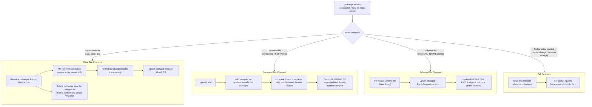

#### Partial Update Steps — Code File Changed

```
FUNCTION partial_update_code_file(changed_file_path):

  // ── Step 1: Identify what was in DB for this file ─────────────
  old_fact_ids = vector_db.query(
      filter = { source_ref: changed_file_path },
      return_ids_only = True
  )
  old_node_ids = graph_db.query(
      "MATCH (n {source_ref: $ref}) RETURN n.id",
      params = { ref: changed_file_path }
  )

  // ── Step 2: Re-extract the changed file ───────────────────────
  chunks    = chunk_file(changed_file_path)
  new_facts = extract_all_layers(chunks)   // L1–L4, temp=0

  // ── Step 3: Re-run entity resolution for new names only ───────
  new_names = collect_entity_names(new_facts)
  existing_registry = load_json(output_dir/entity_registry.json)

  FOR each name IN new_names:
      IF name NOT IN existing_registry:
          run_resolution(name)             // only resolve genuinely new entities
          update_registry(name, result)    // append to existing registry

  // ── Step 4: Delete stale data from DBs ────────────────────────
  // Graph DB: delete old nodes from this file (CASCADE removes their edges too)
  FOR each node_id IN old_node_ids:
      graph_db.DELETE node WHERE id = node_id  // and all edges where from=id or to=id

  // Vector DB: delete old docs from this file
  FOR each fact_id IN old_fact_ids:
      vector_db.delete(collection=all_collections, id=fact_id)

  // ── Step 5: Write new data ─────────────────────────────────────
  write_to_graph_db(new_facts, registry)
  write_to_vector_db(new_facts, graph_node_id_map, registry)

  // ── Step 6: Repair dangling edges ─────────────────────────────
  // Other files may have had edges pointing TO nodes from this file
  dangling = graph_db.query(
      "MATCH (a)-[r]->(b) WHERE b.source_ref = $ref AND NOT EXISTS(b.id) RETURN r"
  )
  FOR each dangling_edge:
      IF target now exists in new_facts:
          re-create edge with new target_id
      ELSE:
          leave as skipped_edge (target may be in another file)
```

#### Partial Update Steps — New File Added

```
FUNCTION partial_update_new_file(new_file_path):

  // No deletion needed — just add
  chunks    = chunk_file(new_file_path)
  new_facts = extract_all_layers(chunks)

  // Resolve only the new entity names (don't re-resolve the whole registry)
  new_names = collect_entity_names(new_facts)
  run_resolution(new_names, append_to_existing_registry=True)

  write_to_graph_db(new_facts, registry)
  write_to_vector_db(new_facts, graph_node_id_map, registry)

  // Check if new nodes resolve any previously skipped edges
  FOR each skipped_edge IN skipped_edges_log:
      IF skipped_edge.to_unresolved NOW matches a new node:
          graph_db.CREATE edge(from=skipped_edge.from, to=new_node_id, type=edge_type)
```

#### Partial Update Steps — File Deleted

```
FUNCTION partial_update_file_deleted(deleted_file_path):

  // ── Find everything from this file ────────────────────────────
  node_ids   = graph_db.query("MATCH (n {source_ref: $ref}) RETURN n.id")
  vector_ids = vector_db.query(filter={source_ref: deleted_file_path}, return_ids_only=True)

  // ── Delete from Graph DB ───────────────────────────────────────
  FOR each node_id:
      graph_db.DELETE node + all edges where from=node_id OR to=node_id
      // Nodes in OTHER files that pointed HERE now have dangling edges
      // → log them in skipped_edges for future resolution

  // ── Delete from Vector DB ──────────────────────────────────────
  FOR each vector_id:
      vector_db.delete(vector_id)

  // ── Remove from entity registry ───────────────────────────────
  FOR each entity in registry WHERE entity.source_ref = deleted_file_path:
      IF entity has no other source_ref:
          remove entity from registry
      ELSE:
          update source_ref to surviving file
```

#### Stability Rule: Deterministic IDs Prevent Ghost Data

```
// WHY deterministic IDs matter for partial updates:
//
// node_id = SHA-256[:16] of canonical_name
//
// Before update:  DiagnosticsEngine.RunCheck → node_id = "a3f9c1d2e4b56780"
// After update:   DiagnosticsEngine.RunCheck → node_id = "a3f9c1d2e4b56780"  (SAME)
//
// Because the ID is derived from the canonical name (not a random UUID),
// MERGE in the graph DB and upsert in the vector DB will UPDATE the existing
// record rather than create a duplicate.
//
// If you used random UUIDs:
//   - Old record: id=uuid-1  (orphaned)
//   - New record: id=uuid-2  (duplicate)
//   → you would accumulate stale data with every update
//
// With SHA-256 of canonical_name:
//   - MERGE always hits the same node → clean update, no orphans
```

#### Summary Table — When to Run What

| Event | Graph DB | Vector DB | Entity Registry | Full pipeline? |
|---|---|---|---|---|
| Single file changed | Delete old nodes → write new | Delete old docs → upsert new | Append new names only | No |
| New file added | Upsert new nodes + edges | Upsert new docs | Append new names only | No |
| File deleted | Delete nodes + CASCADE edges | Delete matching docs | Remove or reassign | No |
| Confluence doc updated | `openkb add` re-runs | Delete old DocumentSection → upsert new | No change | No |
| Embedding model changed | No change | **Drop all collections → re-embed everything** | No change | Vector only |
| Schema (Pydantic) changed | Re-hydrate affected layer | Re-embed affected collection | No change | Partial |
| First-time setup | Full import | Full import | Full resolution | Yes |

---

---

## 12. Observability & Consumer Interfaces

The v0.3 diagram's **"0. Consumers & Observability"** layer covers who uses the system and how it is monitored. This section documents both.

---

### 12.1 Consumer Interfaces

| Consumer | Interface | What they use |
|---|---|---|
| **Human Users** | Obsidian (local vault) + Web UI | Read compiled wiki pages from the Central Git Repository; query via the REST API or MCP server |
| **AI Agents & Workflows** | REST API (`/query`) or MCP server (`kb mcp`) | Structured `QueryResponse` objects with citations and graph paths; no UI needed |
| **CI/CD Pipeline** | `kb extract` + `kb import` CLI | Automated re-indexing on commit; triggered by Git hooks or Airflow |
| **VS Code Copilot** | MCP server (`kb mcp --port 3000`) | Tool calls to `/query`, `/graph`, `/vector` from within the editor |

#### Obsidian Integration

The Central Git Repository (wiki/) can be opened directly as an Obsidian vault. Frontmatter fields become Obsidian properties; `entities_mentioned` fields become internal links.

```
// .obsidian/app.json — point vault at the wiki/ folder
// wiki/concepts/DiagnosticsEngine.md opens as a normal note
// frontmatter renders as properties panel
// graph_node_ids are shown as custom properties (not links)
```

---

### 12.2 Observability Stack

The diagram shows **OpenTelemetry + Grafana + Jaeger**. Instrument the pipeline and API server so failures, latency, and quality regressions are visible.

#### What to instrument

| Component | Metric / Trace | Alert threshold |
|---|---|---|
| Sync Service | `sync.docs_pulled` count, `sync.latency_ms` | Latency > 30s per connector |
| OpenKB Compiler | `compilation.pages_built`, `compilation.quality_fail_rate` | Fail rate > 10% |
| LLM Extractor | `extraction.facts_per_chunk`, `extraction.llm_latency_ms`, `extraction.validation_fail_rate` | Validation fail rate > 5% |
| Graph DB write | `graph.nodes_upserted`, `graph.edges_skipped`, `graph.write_latency_ms` | Skipped edges > 20% |
| Vector DB write | `vector.docs_upserted`, `vector.embed_latency_ms` | Embed latency > 2s |
| Query API | `query.latency_ms` (p50/p95/p99), `query.overall_confidence`, `query.answer_grounded_rate` | p95 > 3s or grounded rate < 80% |

#### Stack Configuration

```yaml
# Add to docker-compose.yml

  # ── OpenTelemetry Collector ───────────────────────────────────
  otel-collector:
    image: otel/opentelemetry-collector-contrib:0.100.0
    container_name: kb-otel
    ports:
      - "4317:4317"    # gRPC receiver
      - "4318:4318"    # HTTP receiver
    volumes:
      - ./config/otel-collector.yaml:/etc/otelcol/config.yaml

  # ── Jaeger — Distributed Tracing ─────────────────────────────
  jaeger:
    image: jaegertracing/all-in-one:1.58
    container_name: kb-jaeger
    ports:
      - "16686:16686"  # Jaeger UI
      - "14250:14250"  # gRPC from OTel collector

  # ── Grafana — Dashboards ──────────────────────────────────────
  grafana:
    image: grafana/grafana:10.4.0
    container_name: kb-grafana
    ports:
      - "3001:3000"    # Grafana UI (offset to avoid conflict with MCP)
    volumes:
      - grafana_data:/var/lib/grafana
      - ./config/grafana/dashboards:/etc/grafana/provisioning/dashboards
```

#### Instrumentation Points (Python)

```
// Add to kb-api and pipeline CLI:

SETUP:
    tracer = OpenTelemetry.get_tracer("kb-pipeline")
    meter  = OpenTelemetry.get_meter("kb-pipeline")

FOR each pipeline stage:
    WITH tracer.start_span(stage_name) AS span:
        span.set_attribute("source_ref", file_path)
        result = run_stage()
        span.set_attribute("facts_produced", len(result.facts))
        meter.counter("facts_produced").add(len(result.facts))

FOR each query:
    WITH tracer.start_span("query") AS span:
        span.set_attribute("question_type", intent.question_type)
        response = execute_query()
        span.set_attribute("overall_confidence", response.overall_confidence)
        span.set_attribute("answer_grounded", response.answer_grounded)
```

#### Key Dashboards

| Dashboard | Panels |
|---|---|
| **Ingestion Health** | Docs synced/hr, quality pass rate, OpenKB compile time, LLM extraction latency |
| **Storage Health** | Graph node count over time, vector doc count, skipped edges trend |
| **Query Performance** | Query latency p50/p95/p99, confidence distribution, grounded answer rate |
| **Error Rates** | LLM validation failures, DB write errors, connector sync failures |

---

---

## 13. Pydantic Models — Complete Definitions

All models live in `src/models/facts.py`. Import them from there everywhere else.

```python
# src/models/facts.py
from __future__ import annotations
from datetime import date
from typing import Literal, Optional
from pydantic import BaseModel, Field, field_validator
import hashlib


def make_node_id(canonical_name: str) -> str:
    """SHA-256[:16] of canonical_name. Keep casing. Strip whitespace. UTF-8."""
    return hashlib.sha256(canonical_name.strip().encode("utf-8")).hexdigest()[:16]


# ── INPUT → TRANSFORM hand-off ───────────────────────────────────────────────

class Chunk(BaseModel):
    chunk_id: str                        # make_node_id(source_ref + str(source_line_start))
    source_type: Literal[
        "code", "confluence", "sharepoint", "openapi",
        "runbook", "markdown", "html"
    ]
    source_ref: str                      # relative path or URL
    source_line_start: int
    source_line_end: int
    language: Literal[
        "csharp", "cpp", "typescript", "javascript",
        "python", "markdown", "html", "json"
    ]
    content: str
    estimated_tokens: int


# ── Layer 1 — structural.json ─────────────────────────────────────────────────

class Relation(BaseModel):
    type: Literal[
        "calls", "implements", "inherits", "references",
        "depends_on", "part_of", "emits", "produces"
    ]
    target: str                          # fully qualified canonical name of target

class EntityFact(BaseModel):
    id: str                              # make_node_id(canonical_name)
    canonical_name: str                  # namespace.class.method
    aliases: list[str] = []
    kind: Literal["class", "method", "interface", "enum", "property", "constant"]
    source_type: str
    source_ref: str
    source_line_start: int
    source_line_end: int
    layer: Optional[str] = None          # APILayer | PsdrCoreLayer | IOLayer | Shared
    tags: list[str] = []
    relations: list[Relation] = []
    confidence: Literal["high", "medium", "low"] = "high"

    @field_validator("id")
    @classmethod
    def must_be_16_hex(cls, v: str) -> str:
        assert len(v) == 16 and all(c in "0123456789abcdef" for c in v), \
            f"id must be 16 lowercase hex chars, got: {v!r}"
        return v


# ── Layer 2 — behavioral.json ─────────────────────────────────────────────────

class RuleFact(BaseModel):
    id: str
    owner_entity: str
    condition: str
    true_path: str
    false_path: str
    linked_outcome: Optional[str] = None
    linked_resolution: Optional[str] = None
    source_ref: str
    source_line: int
    source_type: str
    confidence: Literal["high", "medium", "low"] = "high"


# ── Layer 3 — contracts.json ──────────────────────────────────────────────────

class InputParam(BaseModel):
    name: str
    type: str
    nullable: bool = False
    constraint: Optional[str] = None
    description: Optional[str] = None

class OutputParam(BaseModel):
    name: str
    type: str
    nullable: bool = False
    description: Optional[str] = None

class OutcomeCode(BaseModel):
    value_name: str
    meaning: str
    recoverable: bool
    severity: Literal["info", "warning", "error", "critical"]

class ContractFact(BaseModel):
    id: str
    entity_name: str
    summary: Optional[str] = None
    inputs: list[InputParam] = []
    outputs: list[OutputParam] = []
    outcome_codes: list[OutcomeCode] = []
    preconditions: Optional[str] = None
    postconditions: Optional[str] = None
    source_ref: str
    source_line: int
    source_type: str


# ── Layer 4 — operational.json ────────────────────────────────────────────────

class Assertion(BaseModel):
    what: str
    expected_value: str
    check_method: str

class ContextOverride(BaseModel):
    dependency: str
    override_method: str
    return_value: str

class OperationalFact(BaseModel):
    id: str
    trace_name: str
    scenario: str
    action: str
    assertions: list[Assertion] = []
    context_overrides: list[ContextOverride] = []
    implied_behavior: str
    covers_failure_path: bool
    source_ref: str
    source_line: int
    source_type: str


# ── Layer 5 — evidence.json ───────────────────────────────────────────────────

class Evidence(BaseModel):
    fact_id: str
    source_ref: str
    source_line_start: Optional[int] = None
    source_line_end: Optional[int] = None
    source_snippet: str
    confidence: Literal["high", "medium", "low"]
    extraction_date: date
    alternative_interpretations: Optional[str] = None

class EvidenceFact(BaseModel):
    fact_id: str
    evidence: Evidence


# ── Vector DB document ────────────────────────────────────────────────────────

class VectorDocMetadata(BaseModel):
    layer: int
    kind: str
    source_type: str
    entity_name: str
    source_ref: str
    source_line_start: int
    source_line_end: int
    confidence: str
    graph_node_id: Optional[str] = None  # bridge to Graph DB node
    canonical_name: str
    aliases: list[str] = []
    extraction_date: str                  # ISO 8601

class VectorDocument(BaseModel):
    id: str
    collection: Literal[
        "BehavioralRule", "EntityContract", "OutcomeRecord",
        "ObservableEvent", "OperationalTrace", "DocumentSection"
    ]
    text: str                             # alias-injected sentence (see §14)
    metadata: VectorDocMetadata


# ── Graph DB structures ───────────────────────────────────────────────────────

class GraphNode(BaseModel):
    id: str
    label: Literal["Entity", "Outcome", "Event", "Rule"]
    properties: dict

class GraphEdge(BaseModel):
    from_id: str = Field(alias="from")
    to_id: str   = Field(alias="to")
    relation: str
    properties: dict
    model_config = {"populate_by_name": True}

class GraphTriple(BaseModel):
    nodes: list[GraphNode]
    edges: list[GraphEdge]
    skipped_edges: list[dict] = []


# ── Entity Registry ───────────────────────────────────────────────────────────

class RegistryEntry(BaseModel):
    canonical_name: str
    aliases: list[str] = []
    node_id: str                          # make_node_id(canonical_name)
    confidence: Literal["high", "medium", "low"]
    source_refs: list[str] = []

class EntityRegistry(BaseModel):
    entries: list[RegistryEntry] = []

    def lookup(self, name: str) -> Optional[str]:
        """Return node_id for exact canonical_name or any alias. None if not found."""
        for entry in self.entries:
            if name == entry.canonical_name or name in entry.aliases:
                return entry.node_id
        return None

    def aliases_for(self, name: str) -> list[str]:
        """Return all aliases for a name (excluding the name itself)."""
        for entry in self.entries:
            if name == entry.canonical_name or name in entry.aliases:
                return [a for a in entry.aliases if a != name]
        return []
```

---

## 13.5 `JobManager` — Background Job Orchestration

Lives in `src/pipeline/job_manager.py`. This is the glue between the UI (which submits a job and polls for status) and the pipeline (which runs the 6-step extraction + storage flow). **This is the most important file for making the UI work.**

```python
# src/pipeline/job_manager.py
import uuid
import asyncio
from dataclasses import dataclass, field
from datetime import datetime, timezone
from typing import Literal, Optional
from pathlib import Path


@dataclass
class IngestJob:
    job_id: str
    status: Literal["queued", "running", "done", "failed"] = "queued"
    source_label: str = ""            # filename / repo URL / URL (for UI display)
    source_type: Literal["file", "repo", "url"] = "file"
    progress_pct: float = 0.0
    current_step: str = "Queued"
    facts_extracted: int = 0
    nodes_written: int = 0
    vectors_written: int = 0
    error: Optional[str] = None
    started_at: Optional[str] = None
    completed_at: Optional[str] = None


# Module-level registry: job_id → IngestJob
# In production replace with Redis or a DB table for multi-worker deployments
_jobs: dict[str, IngestJob] = {}


class JobManager:

    @staticmethod
    def create(source_label: str, source_type: str) -> IngestJob:
        """Create a new job in 'queued' state and register it."""
        job = IngestJob(
            job_id=str(uuid.uuid4()),
            source_label=source_label,
            source_type=source_type,  # type: ignore
        )
        _jobs[job.job_id] = job
        return job

    @staticmethod
    def get(job_id: str) -> Optional[IngestJob]:
        return _jobs.get(job_id)

    @staticmethod
    def list_all() -> list[IngestJob]:
        return sorted(_jobs.values(), key=lambda j: j.started_at or "", reverse=True)

    @staticmethod
    def cancel(job_id: str) -> bool:
        job = _jobs.get(job_id)
        if job and job.status in ("queued", "running"):
            job.status = "failed"
            job.error  = "Cancelled by user"
            return True
        return False


async def run_ingest_job(job: IngestJob, source_path: Path) -> None:
    """
    Background task: runs the full 6-step pipeline for one source.
    Updates job.progress_pct and job.current_step throughout so the
    UI polling /api/ingest/jobs/{id} shows live progress.

    Steps and their progress_pct ranges:
        Step 1 — Walk + Chunk:         0 → 15%
        Step 2 — Extract L1-L4:       15 → 50%   (largest step)
        Step 3 — Evidence (L5):       50 → 60%
        Step 4 — Entity resolution:   60 → 70%
        Step 5 — Graph hydrate+write: 70 → 85%
        Step 6 — Vector embed+write:  85 → 100%
    """
    from src.pipeline.walker   import walk_dir
    from src.pipeline.chunker  import chunk_file
    from src.pipeline.extractor import extract_all_layers, enrich_layer5
    from src.pipeline.resolver import resolve_entities
    from src.pipeline.hydrator import hydrate
    from src.storage.protocols import get_graph_store, get_vector_store
    from src.pipeline.extractor import build_vector_text, route_to_collection
    from src.models.facts       import EntityRegistry
    import os, json

    job.status     = "running"
    job.started_at = datetime.now(timezone.utc).isoformat()

    try:
        # ── Step 1: Walk + Chunk (0→15%) ────────────────────────────
        job.current_step = "Step 1/6 — Scanning and chunking source"
        job.progress_pct = 2.0
        files = walk_dir(source_path)
        chunks = []
        for i, f in enumerate(files):
            chunks.extend(chunk_file(f))
            job.progress_pct = 2.0 + 13.0 * (i + 1) / max(len(files), 1)
        await asyncio.sleep(0)  # yield to event loop so UI poll can get through

        # ── Step 2: Extract L1-L4 (15→50%) ─────────────────────────
        facts_by_layer = {}
        for layer in [1, 2, 3, 4]:
            job.current_step = f"Step 2/6 — Extracting layer {layer} / 4"
            job.progress_pct = 15.0 + 35.0 * (layer / 4)
            facts_by_layer[layer] = await extract_all_layers(chunks, layer)
            await asyncio.sleep(0)

        all_facts = [f for facts in facts_by_layer.values() for f in facts]
        job.facts_extracted = len(all_facts)

        # ── Step 3: Evidence / Layer 5 (50→60%) ──────────────────────
        job.current_step = "Step 3/6 — Adding provenance (layer 5)"
        job.progress_pct = 55.0
        evidence = await enrich_layer5(all_facts, source_path)
        await asyncio.sleep(0)

        # ── Step 4: Entity resolution (60→70%) ──────────────────────
        job.current_step = "Step 4/6 — Resolving entity names and aliases"
        job.progress_pct = 62.0
        output_dir = Path(os.getenv("OUTPUT_DIR", "./output"))
        output_dir.mkdir(parents=True, exist_ok=True)
        registry: EntityRegistry = resolve_entities(all_facts, output_dir)
        await asyncio.sleep(0)

        # ── Step 5: Graph hydrate + write (70→85%) ──────────────────
        job.current_step = "Step 5/6 — Writing to graph database"
        job.progress_pct = 72.0
        triples = hydrate(facts_by_layer[1] + facts_by_layer[2] + facts_by_layer[3], registry)
        graph_store = get_graph_store()
        node_id_map: dict[str, str] = {}
        for triple in triples:
            for node in triple.nodes:
                graph_store.merge_node(node.label, node.id, node.properties)
                node_id_map[node.properties.get("canonical_name", "")] = node.id
            for edge in triple.edges:
                graph_store.merge_edge(edge.from_id, edge.to_id, edge.relation, edge.properties)
        job.nodes_written = graph_store.get_node_count()
        job.progress_pct  = 85.0
        await asyncio.sleep(0)

        # ── Step 6: Vector embed + write (85→100%) ─────────────────
        job.current_step = "Step 6/6 — Embedding and writing to vector database"
        job.progress_pct = 87.0
        vector_store = get_vector_store()
        embed_model  = _load_embed_model()
        vec_facts    = facts_by_layer[2] + facts_by_layer[3] + facts_by_layer[4]
        for i, fact in enumerate(vec_facts):
            text       = build_vector_text(fact, registry)
            collection = route_to_collection(fact)
            vector     = embed_model.encode(text).tolist()
            vector_store.upsert(
                collection = collection,
                id         = fact["id"],
                vector     = vector,
                document   = text,
                metadata   = {
                    "layer":            fact.get("_layer", 0),
                    "kind":             fact.get("_fact_kind", "unknown"),
                    "source_type":      fact.get("source_type", ""),
                    "entity_name":      fact.get("canonical_name") or fact.get("entity_name", ""),
                    "source_ref":       fact.get("source_ref", ""),
                    "source_line_start":fact.get("source_line", 0),
                    "source_line_end":  fact.get("source_line", 0),
                    "confidence":       fact.get("confidence", "medium"),
                    "graph_node_id":    node_id_map.get(fact.get("canonical_name", ""), ""),
                    "canonical_name":   fact.get("canonical_name") or fact.get("entity_name", ""),
                    "aliases":          registry.aliases_for(fact.get("canonical_name", "")),
                    "extraction_date":  datetime.now(timezone.utc).date().isoformat(),
                },
            )
            job.progress_pct  = 87.0 + 13.0 * (i + 1) / max(len(vec_facts), 1)
            if i % 50 == 0:
                await asyncio.sleep(0)  # yield every 50 facts

        job.vectors_written  = sum(
            vector_store.get_collection_count(c) for c in [
                "BehavioralRule", "EntityContract", "OutcomeRecord",
                "ObservableEvent", "OperationalTrace", "DocumentSection"
            ]
        )
        job.status       = "done"
        job.progress_pct = 100.0
        job.current_step = "Complete"

    except Exception as exc:
        job.status      = "failed"
        job.error       = str(exc)
        job.current_step = "Failed"

    finally:
        job.completed_at = datetime.now(timezone.utc).isoformat()


def _load_embed_model():
    """Load the embedding model specified in EMBEDDING_MODEL env var."""
    import os
    model_name = os.getenv("EMBEDDING_MODEL", "all-MiniLM-L6-v2")
    if model_name.startswith("text-embedding"):           # OpenAI
        from openai import OpenAI
        client = OpenAI()
        class _OpenAIEmbedder:
            def encode(self, text: str) -> list[float]:
                resp = client.embeddings.create(model=model_name, input=text)
                return resp.data[0].embedding
        return _OpenAIEmbedder()
    else:                                                  # sentence-transformers / local
        from sentence_transformers import SentenceTransformer
        return SentenceTransformer(model_name)
```

#### How routes use JobManager

```python
# src/api/routes/ingest.py  — complete implementation of ingest_file route

@router.post("/file", response_model=JobStatusResponse)
async def ingest_file(
    background_tasks: BackgroundTasks,
    file: UploadFile = File(...),
    language: str = Form("auto"),
    layers: str = Form("1,2,3,4,5"),
):
    from src.pipeline.job_manager import JobManager, run_ingest_job
    from src.adapters.file_ingester import save_upload
    import os

    file_bytes = await file.read()
    raw_dir    = os.getenv("RAW_DOCS_DIR", "./raw_docs")
    dest_path  = save_upload(file_bytes, file.filename or "upload", raw_dir)

    job = JobManager.create(source_label=file.filename or "upload", source_type="file")
    background_tasks.add_task(run_ingest_job, job, dest_path)

    return JobStatusResponse(**job.__dict__)


@router.get("/jobs/{job_id}", response_model=JobStatusResponse)
async def get_job(job_id: str):
    from src.pipeline.job_manager import JobManager
    from fastapi import HTTPException
    job = JobManager.get(job_id)
    if not job:
        raise HTTPException(status_code=404, detail=f"Job {job_id} not found")
    return JobStatusResponse(**job.__dict__)


@router.get("/jobs", response_model=JobListResponse)
async def list_jobs():
    from src.pipeline.job_manager import JobManager
    jobs = [JobStatusResponse(**j.__dict__) for j in JobManager.list_all()]
    return JobListResponse(jobs=jobs)
``` — Sentence Templates

Lives in `src/pipeline/extractor.py`. This function converts a structured fact dict into the plain-text string that gets embedded. **Retrieval quality depends entirely on this function.** Each fact type has its own template.

The extractor must inject a `_fact_kind` field into every fact dict before calling this function so the router can branch correctly.

```python
# src/pipeline/extractor.py

def fact_to_sentence(fact: dict) -> str:
    """
    Convert a structured fact dict to a natural-language sentence for embedding.
    Caller must have set fact['_fact_kind'] to one of:
        'rule' | 'contract' | 'outcome' | 'event' | 'operational' | 'document'
    """
    kind = fact.get("_fact_kind", "document")

    if kind == "rule":
        # Source: RuleFact
        return (
            f"When {fact['condition']}, then: {fact['true_path']}. "
            f"Otherwise: {fact['false_path']}. "
            f"Outcome: {fact.get('linked_outcome') or 'none'}. "
            f"Fix: {fact.get('linked_resolution') or 'none'}."
        )

    if kind == "contract":
        # Source: ContractFact
        inputs  = ", ".join(p["name"] for p in fact.get("inputs",  [])) or "none"
        outputs = ", ".join(p["name"] for p in fact.get("outputs", [])) or "none"
        codes   = ", ".join(c["value_name"] for c in fact.get("outcome_codes", [])) or "none"
        summary = fact.get("summary") or "No description."
        return (
            f"{fact['entity_name']}: {summary} "
            f"Accepts: {inputs}. Returns: {outputs}. "
            f"Outcome codes: {codes}."
        )

    if kind == "outcome":
        # Source: OutcomeCode (extracted from ContractFact.outcome_codes, stored separately)
        return (
            f"{fact['value_name']}: {fact['meaning']} "
            f"Severity: {fact['severity']}. "
            f"Recoverable: {'yes' if fact['recoverable'] else 'no'}."
        )

    if kind == "event":
        # Source: telemetry event (from ContractFact, kind=event)
        return (
            f"Event {fact['canonical_name']} is triggered when "
            f"{fact.get('trigger_condition', 'condition unknown')}. "
            f"Type: {fact.get('event_type', 'unknown')}."
        )

    if kind == "operational":
        # Source: OperationalFact
        assertions = "; ".join(a["what"] for a in fact.get("assertions", [])) or "none"
        return (
            f"{fact['scenario']}. "
            f"Action: {fact['action']}. "
            f"Asserts: {assertions}. "
            f"Proves: {fact['implied_behavior']}."
        )

    # Default: DocumentSection (from wiki/concepts/*.md)
    # 'content' is the raw section text — already human-readable
    return fact.get("content", "")


def build_vector_text(fact: dict, registry: "EntityRegistry") -> str:
    """
    Build the final embedded text: fact sentence + alias injection.
    e.g. 'When SpoolerStatus is Stopped (also known as: spooler_stopped, ServiceStopped), ...'
    """
    base = fact_to_sentence(fact)
    canonical = fact.get("canonical_name") or fact.get("entity_name", "")
    aliases = registry.aliases_for(canonical)
    if aliases:
        base += f" (also known as: {', '.join(aliases)})"
    return base
```

---

## 15. UI Layer — Web Interface

The UI replaces all CLI interactions for end users. The backend serves the React app as static files. The pipeline still runs on the server — the UI is a job submission and monitoring front end.

### 15.0 Build Configuration Files

#### `Dockerfile`

```dockerfile
# Dockerfile — builds the kb-api Python server
FROM python:3.11-slim

WORKDIR /app

# Install system dependencies for tree-sitter and gitpython
RUN apt-get update && apt-get install -y \
    git build-essential libffi-dev \
    && rm -rf /var/lib/apt/lists/*

COPY pyproject.toml .
RUN pip install --no-cache-dir -e .

COPY src/ ./src/
COPY ui/dist/ ./ui/dist/

EXPOSE 8000

CMD ["uvicorn", "src.api.main:app", "--host", "0.0.0.0", "--port", "8000"]
```

#### `ui/vite.config.ts`

```typescript
// ui/vite.config.ts
import { defineConfig } from 'vite'
import react from '@vitejs/plugin-react'

export default defineConfig({
  plugins: [react()],
  build: {
    outDir: '../ui/dist',   // served by FastAPI as static files
    emptyOutDir: true,
  },
  server: {
    port: 5173,
    proxy: {
      '/api': {             // forward /api/* to the FastAPI dev server
        target: 'http://localhost:8000',
        changeOrigin: true,
      },
    },
  },
})
```

#### `ui/tsconfig.json`

```json
{
  "compilerOptions": {
    "target": "ES2020",
    "useDefineForClassFields": true,
    "lib": ["ES2020", "DOM", "DOM.Iterable"],
    "module": "ESNext",
    "skipLibCheck": true,
    "moduleResolution": "bundler",
    "allowImportingTsExtensions": true,
    "resolveJsonModule": true,
    "isolatedModules": true,
    "noEmit": true,
    "jsx": "react-jsx",
    "strict": true
  },
  "include": ["src"]
}
```

#### `ui/tailwind.config.js`

```javascript
// ui/tailwind.config.js
/** @type {import('tailwindcss').Config} */
export default {
  content: ['./index.html', './src/**/*.{js,ts,jsx,tsx}'],
  theme: { extend: {} },
  plugins: [],
}
```

#### `ui/src/api/client.ts` — all fetch wrappers

```typescript
// ui/src/api/client.ts
import type { JobStatusResponse, JobListResponse, QueryRequest, QueryResponse, StatsResponse } from '../types'

const BASE = '/api'

async function json<T>(res: Response): Promise<T> {
  if (!res.ok) throw new Error(`HTTP ${res.status}: ${await res.text()}`)
  return res.json() as Promise<T>
}

export async function ingestFile(
  file: File,
  language = 'auto',
  layers = [1, 2, 3, 4, 5]
): Promise<JobStatusResponse> {
  const form = new FormData()
  form.append('file', file)
  form.append('language', language)
  form.append('layers', layers.join(','))
  return json(await fetch(`${BASE}/ingest/file`, { method: 'POST', body: form }))
}

export async function ingestRepo(
  repo_url: string,
  branch = 'main',
  path_filter = '',
  language = 'auto'
): Promise<JobStatusResponse> {
  return json(await fetch(`${BASE}/ingest/repo`, {
    method: 'POST',
    headers: { 'Content-Type': 'application/json' },
    body: JSON.stringify({ repo_url, branch, path_filter, language }),
  }))
}

export async function ingestUrl(
  url: string,
  title?: string
): Promise<JobStatusResponse> {
  return json(await fetch(`${BASE}/ingest/url`, {
    method: 'POST',
    headers: { 'Content-Type': 'application/json' },
    body: JSON.stringify({ url, title }),
  }))
}

export async function listJobs(): Promise<JobListResponse> {
  return json(await fetch(`${BASE}/ingest/jobs`))
}

export async function pollJob(job_id: string): Promise<JobStatusResponse> {
  return json(await fetch(`${BASE}/ingest/jobs/${job_id}`))
}

export async function cancelJob(job_id: string): Promise<void> {
  const res = await fetch(`${BASE}/ingest/jobs/${job_id}`, { method: 'DELETE' })
  if (!res.ok && res.status !== 204) throw new Error(`HTTP ${res.status}`)
}

export async function runQuery(req: QueryRequest): Promise<QueryResponse> {
  return json(await fetch(`${BASE}/query`, {
    method: 'POST',
    headers: { 'Content-Type': 'application/json' },
    body: JSON.stringify(req),
  }))
}

export async function getStats(): Promise<StatsResponse> {
  return json(await fetch(`${BASE}/stats`))
}
``` — `src/api/main.py`

```python
# src/api/main.py
from fastapi import FastAPI
from fastapi.middleware.cors import CORSMiddleware
from fastapi.staticfiles import StaticFiles
from pathlib import Path
import os

from src.api.routes import ingest, query, stats

app = FastAPI(title="Knowledge Base API", version="1.0.0")

# CORS — allow the Vite dev server and production origins
origins = os.getenv("CORS_ORIGINS", "http://localhost:5173").split(",")
app.add_middleware(
    CORSMiddleware,
    allow_origins=origins,
    allow_methods=["*"],
    allow_headers=["*"],
)

app.include_router(ingest.router, prefix="/api/ingest", tags=["ingest"])
app.include_router(query.router,  prefix="/api",        tags=["query"])
app.include_router(stats.router,  prefix="/api",        tags=["stats"])

# Serve the React build — must be registered LAST so /api routes take priority
ui_dist = Path(__file__).parent.parent.parent / "ui" / "dist"
if ui_dist.exists():
    app.mount("/", StaticFiles(directory=str(ui_dist), html=True), name="static")
```

### 15.2 API Route Signatures — `src/api/routes/`

```python
# src/api/routes/ingest.py

from fastapi import APIRouter, UploadFile, File, Form, BackgroundTasks
from src.api.schemas import (
    IngestRepoRequest, IngestUrlRequest,
    JobStatusResponse, JobListResponse
)

router = APIRouter()

@router.post("/file", response_model=JobStatusResponse)
async def ingest_file(
    background_tasks: BackgroundTasks,
    file: UploadFile = File(...),
    language: str = Form("auto"),           # csharp | cpp | typescript | javascript | python | auto
    layers: str = Form("1,2,3,4,5"),        # comma-separated layer numbers
):
    """Upload a single file (.cs, .cpp, .ts, .py, .pdf, .docx, .md) and start ingestion."""
    ...

@router.post("/repo", response_model=JobStatusResponse)
async def ingest_repo(body: IngestRepoRequest, background_tasks: BackgroundTasks):
    """Provide a public or authenticated Git repo URL and start ingestion."""
    ...

@router.post("/url", response_model=JobStatusResponse)
async def ingest_url(body: IngestUrlRequest, background_tasks: BackgroundTasks):
    """Provide a Confluence page URL, SharePoint URL, or any HTML URL."""
    ...

@router.get("/jobs", response_model=JobListResponse)
async def list_jobs():
    """Return all current and recent ingestion jobs."""
    ...

@router.get("/jobs/{job_id}", response_model=JobStatusResponse)
async def get_job(job_id: str):
    """Get status and progress of a specific ingestion job."""
    ...

@router.delete("/jobs/{job_id}", status_code=204)
async def cancel_job(job_id: str):
    """Cancel a queued or running job."""
    ...
```

```python
# src/api/routes/query.py

from fastapi import APIRouter
from src.api.schemas import QueryRequest, QueryResponse

router = APIRouter()

@router.post("/query", response_model=QueryResponse)
async def query_kb(body: QueryRequest):
    """Run a natural language question against the knowledge base."""
    ...
```

```python
# src/api/routes/stats.py

from fastapi import APIRouter
from src.api.schemas import StatsResponse

router = APIRouter()

@router.get("/stats", response_model=StatsResponse)
async def get_stats():
    """Return graph node/edge counts and vector document counts per collection."""
    ...

@router.get("/health")
async def health():
    return {"status": "ok"}
```

### 15.3 API Pydantic Schemas — `src/api/schemas.py`

```python
# src/api/schemas.py
from __future__ import annotations
from typing import Literal, Optional
from pydantic import BaseModel, HttpUrl


# ── Ingest requests ───────────────────────────────────────────────────────────

class IngestRepoRequest(BaseModel):
    repo_url: str                          # https://github.com/org/repo or ssh://...
    branch: str = "main"
    language: Literal[
        "csharp", "cpp", "typescript", "javascript", "python", "auto"
    ] = "auto"
    path_filter: str = ""                  # optional subfolder, e.g. "src/"
    layers: list[int] = [1, 2, 3, 4, 5]

class IngestUrlRequest(BaseModel):
    url: str                               # Confluence, SharePoint, HTML URL
    title: Optional[str] = None           # optional display name for the job


# ── Job status ────────────────────────────────────────────────────────────────

class JobStatusResponse(BaseModel):
    job_id: str
    status: Literal["queued", "running", "done", "failed"]
    source_label: str                      # filename / repo URL / URL (for display)
    source_type: Literal["file", "repo", "url"]
    progress_pct: float                    # 0–100
    current_step: str                      # e.g. "Extracting layer 2 / 5"
    facts_extracted: int = 0
    nodes_written: int = 0
    vectors_written: int = 0
    error: Optional[str] = None
    started_at: Optional[str] = None      # ISO 8601
    completed_at: Optional[str] = None

class JobListResponse(BaseModel):
    jobs: list[JobStatusResponse]


# ── Query ─────────────────────────────────────────────────────────────────────

class QueryRequest(BaseModel):
    question: str
    top_k: int = 10
    filter_layer: Optional[int] = None
    filter_source_type: Optional[str] = None

class CitationItem(BaseModel):
    fact_id: str
    source_ref: str
    start_line: int
    end_line: int
    snippet: str
    relevance_score: float
    confidence: str

class QueryResponse(BaseModel):
    answer: str
    citations: list[CitationItem]
    overall_confidence: float
    graph_paths_used: list[str]
    answer_grounded: bool
    question_type: str                     # structural | behavioral | semantic | multi-hop
    retrieval_lanes_used: list[str]        # ["graph"] | ["vector"] | ["graph", "vector", "pagindex"]


# ── Stats ─────────────────────────────────────────────────────────────────────

class StatsResponse(BaseModel):
    graph_node_count: int
    graph_edge_count: int
    vector_doc_counts: dict[str, int]      # {"BehavioralRule": 42, "EntityContract": 18, ...}
    entity_registry_size: int
    last_ingestion_at: Optional[str] = None
    total_sources_ingested: int = 0
```

### 15.4 React Components — Specification

#### `IngestPanel.tsx` — file upload + Git repo + URL tabs

**State:**
- `activeTab: "file" | "repo" | "url"`
- `isSubmitting: boolean`
- `lastJobId: string | null`

**Layout:** Three tabs side by side. On tab switch, show the relevant form. On submit, call the appropriate API function, set `lastJobId`, and scroll to `<JobList/>` below.

**File tab:**
```
[Drag & drop zone — or click to browse]
[Supported: .cs .cpp .ts .py .pdf .docx .md .json .yaml]

Language:  [Auto-detect ▼]   Layers: [☑1 ☑2 ☑3 ☑4 ☑5]

[Start Ingestion]
```
- File picker accepts: `.cs,.cpp,.h,.ts,.js,.py,.md,.pdf,.docx,.json,.yaml`
- `Auto-detect` infers language from file extension; can be overridden
- Calls `POST /api/ingest/file` as `multipart/form-data`

**Git Repository tab:**
```
Repository URL:  [https://github.com/org/repo          ]
Branch:          [main                                  ]
Path filter:     [src/  (optional — leave blank for all)]
Language:        [Auto-detect ▼]

[Start Ingestion]
```
- Calls `POST /api/ingest/repo` as JSON
- Shows a note: "Private repos require GITHUB_TOKEN in server .env"

**URL / Confluence tab:**
```
URL:    [https://yourorg.atlassian.net/wiki/spaces/...  ]
Title:  [Optional display name                          ]

[Start Ingestion]
```
- Calls `POST /api/ingest/url` as JSON

#### `JobList.tsx` — polling job monitor

- Calls `GET /api/ingest/jobs` every **3 seconds** using TanStack Query's `refetchInterval`
- Renders one `<JobCard/>` per job, newest first
- Shows "No ingestion jobs yet" when list is empty

#### `JobCard.tsx` — single job row

```
[▶ running]  src/Libraries/PrintScanDoctor.cs        started 2 min ago
             ██████████████░░░░░░░░  68%
             Extracting layer 3 / 5
             Facts: 142   Nodes: 38   Vectors: 97
```
- Status badge colour: grey=queued, blue=running, green=done, red=failed
- Progress bar animates from 0–100 using `progress_pct`
- Failed jobs show `error` text in red below the bar

#### `QueryPanel.tsx` — search interface

**Layout:**
```
[What fixes PrinterOffline?                          ] [Search]

─────────────────────────────────────────────────────
<AnswerCard/>  (appears after response arrives)
```
- On submit: calls `POST /api/query`, shows loading spinner
- Passes result to `<AnswerCard/>`

#### `AnswerCard.tsx` — answer display

```
[Structural] [Confidence: 91%] [Grounded ✓]

When the spooler service is stopped, DiagnosticsEngine.RunCheck sets the
outcome to ProblemId.SpoolerStopped and triggers the RestartSpooler fix
action via the RESOLVED_BY graph edge.

Graph path:  DiagnosticsEngine.RunCheck → [PRODUCES] → ProblemId.SpoolerStopped → [RESOLVED_BY] → RestartSpooler

Sources used:
  ▼ DiagnosticsEngine.cs  line 156–161  (score: 0.94, high)
    if (context.SpoolerStatus == ServiceStatus.Stopped) { outcome = ProblemId.SpoolerStopped; }
```
- `question_type` shown as a pill badge
- `overall_confidence` shown as percentage badge
- `answer_grounded` shown as ✓ or ✗
- Each citation is a collapsible row showing `source_ref`, line range, `snippet`, and `relevance_score`

#### `StatsPanel.tsx` — DB dashboard

```
Entities (Graph)   Edges (Graph)   Vector Docs   Registry Entries
    1,284              3,891           8,742            412

Collection Breakdown:
  BehavioralRule     2,140
  EntityContract     1,820
  OutcomeRecord        980
  ObservableEvent      540
  OperationalTrace   2,100
  DocumentSection    1,162

Last ingestion:  2026-06-09 14:23 UTC
```
- Calls `GET /api/stats` on mount and every 30 s
- Numbers animate on change

#### `types.ts` — mirrors all schemas

```typescript
// src/types.ts — generated from Python schemas; keep in sync manually or via openapi-typescript

export type SourceType = "file" | "repo" | "url";
export type JobStatus  = "queued" | "running" | "done" | "failed";

export interface JobStatusResponse {
  job_id: string;
  status: JobStatus;
  source_label: string;
  source_type: SourceType;
  progress_pct: number;
  current_step: string;
  facts_extracted: number;
  nodes_written: number;
  vectors_written: number;
  error?: string;
  started_at?: string;
  completed_at?: string;
}

export interface QueryRequest {
  question: string;
  top_k?: number;
  filter_layer?: number;
  filter_source_type?: string;
}

export interface CitationItem {
  fact_id: string;
  source_ref: string;
  start_line: number;
  end_line: number;
  snippet: string;
  relevance_score: number;
  confidence: string;
}

export interface QueryResponse {
  answer: string;
  citations: CitationItem[];
  overall_confidence: number;
  graph_paths_used: string[];
  answer_grounded: boolean;
  question_type: string;
  retrieval_lanes_used: string[];
}

export interface StatsResponse {
  graph_node_count: number;
  graph_edge_count: number;
  vector_doc_counts: Record<string, number>;
  entity_registry_size: number;
  last_ingestion_at?: string;
  total_sources_ingested: number;
}
```

#### `ui/package.json` — dependencies

```json
{
  "name": "knowledge-base-ui",
  "private": true,
  "version": "0.1.0",
  "type": "module",
  "scripts": {
    "dev":   "vite",
    "build": "tsc && vite build",
    "preview": "vite preview"
  },
  "dependencies": {
    "react":              "^18.3.0",
    "react-dom":          "^18.3.0",
    "react-router-dom":   "^6.23.0",
    "@tanstack/react-query": "^5.40.0"
  },
  "devDependencies": {
    "@types/react":       "^18.3.0",
    "@types/react-dom":   "^18.3.0",
    "@vitejs/plugin-react": "^4.3.0",
    "autoprefixer":       "^10.4.19",
    "postcss":            "^8.4.38",
    "tailwindcss":        "^3.4.4",
    "typescript":         "^5.4.5",
    "vite":               "^5.2.13"
  }
}
```

---

## 16. `wiki_to_json.py` Adapter

### `src/adapters/git_ingester.py`

```python
# src/adapters/git_ingester.py
from pathlib import Path
import git   # pip install gitpython

def clone_repo(url: str, branch: str, dest_dir: str) -> Path:
    """
    Clone a Git repository into dest_dir/<repo_name>.
    If the repo already exists, fetch and reset to the specified branch instead.
    Returns the path to the cloned repo root.

    Supports:
    - Public HTTPS URLs:  https://github.com/org/repo
    - Private HTTPS URLs: https://<token>@github.com/org/repo
      (GITHUB_TOKEN from .env is injected by the route handler before calling this)
    """
    dest = Path(dest_dir)
    dest.mkdir(parents=True, exist_ok=True)
    repo_name = url.rstrip("/").split("/")[-1].removesuffix(".git")
    target    = dest / repo_name

    if target.exists():
        repo = git.Repo(target)
        repo.remote("origin").fetch()
        repo.git.reset("--hard", f"origin/{branch}")
    else:
        git.Repo.clone_from(url, str(target), branch=branch, depth=1)

    return target
```

### `src/adapters/file_ingester.py`

```python
# src/adapters/file_ingester.py
from pathlib import Path
from datetime import datetime, timezone

SUPPORTED_EXTENSIONS = {
    ".cs", ".cpp", ".h", ".ts", ".js",
    ".py", ".md", ".pdf", ".docx", ".json", ".yaml", ".yml"
}

def save_upload(file_bytes: bytes, filename: str, dest_dir: str) -> Path:
    """
    Save uploaded file bytes to dest_dir, adding a timestamp suffix to avoid
    collisions. Returns the full path to the saved file.

    Raises ValueError if the file extension is not in SUPPORTED_EXTENSIONS.
    """
    suffix = Path(filename).suffix.lower()
    if suffix not in SUPPORTED_EXTENSIONS:
        raise ValueError(
            f"Unsupported file type: '{suffix}'. "
            f"Supported: {', '.join(sorted(SUPPORTED_EXTENSIONS))}"
        )

    dest = Path(dest_dir)
    dest.mkdir(parents=True, exist_ok=True)
    stem      = Path(filename).stem
    timestamp = datetime.now(timezone.utc).strftime("%Y%m%d_%H%M%S")
    dest_path = dest / f"{stem}_{timestamp}{suffix}"
    dest_path.write_bytes(file_bytes)
    return dest_path
``` Converts the `wiki/` directory produced by OpenKB into `Chunk` objects ready for the TRANSFORM pipeline.

### OpenKB frontmatter format (what the input looks like)

Every `.md` file in `wiki/concepts/` and `wiki/summaries/` starts with a YAML or JSON frontmatter block between `---` markers:

```markdown
---
title: "DiagnosticsEngine"
source_refs:
  - "src/PsdrCoreLayer/Diagnostics/DiagnosticsEngine.cs"
  - "https://confluence.example.com/wiki/spaces/ENG/pages/123"
source_types:
  - "code"
  - "confluence"
created_at: "2026-06-09T14:00:00Z"
updated_at: "2026-06-09T14:23:00Z"
quality_score: 0.87
tags: ["diagnostics", "core"]
entities_mentioned: ["DiagnosticsEngine", "RunCheck", "PrinterContext"]
graph_node_ids: ["a3f9c1d2e4b56780", "b8e2f4a1c9d3"]
---

## Overview
DiagnosticsEngine is the entry point for all printer diagnostic checks...

## How RunCheck works
RunCheck accepts a PrinterContext and...
```

### Adapter pseudocode

```python
# src/adapters/wiki_to_json.py

import hashlib
import yaml
from pathlib import Path
from src.models.facts import Chunk

def convert_wiki_to_chunks(wiki_dir: Path) -> list[Chunk]:
    """
    Input:  wiki/ directory (output of OpenKB compiler)
    Output: list[Chunk] ready for TRANSFORM pipeline

    Walks wiki/concepts/ and wiki/summaries/.
    Each ## heading becomes one Chunk.
    Frontmatter fields map to Chunk metadata.
    """
    chunks: list[Chunk] = []

    for md_file in sorted((wiki_dir / "concepts").glob("**/*.md")) + \
                   sorted((wiki_dir / "summaries").glob("**/*.md")):

        frontmatter, body = _parse_frontmatter(md_file.read_text(encoding="utf-8"))

        # Map source_type: take first entry in source_types[], default to "markdown"
        source_type = _map_source_type(frontmatter.get("source_types", ["markdown"])[0])

        # Primary source_ref: first entry in source_refs[], fallback to file path
        source_refs = frontmatter.get("source_refs", [])
        primary_ref = source_refs[0] if source_refs else str(md_file.relative_to(wiki_dir))

        # Split body at ## headings — each section becomes one Chunk
        sections = _split_at_h2(body)

        for section in sections:
            chunk_id = hashlib.sha256(
                f"{md_file}{section.start_line}".encode("utf-8")
            ).hexdigest()[:16]

            chunks.append(Chunk(
                chunk_id         = chunk_id,
                source_type      = source_type,
                source_ref       = primary_ref,
                source_line_start= section.start_line,
                source_line_end  = section.end_line,
                language         = "markdown",
                content          = f"# {frontmatter.get('title','')}\n\n{section.text}",
                estimated_tokens = len(section.text.split()) * 4 // 3,  # rough estimate
            ))

    return chunks


def _parse_frontmatter(text: str) -> tuple[dict, str]:
    """Split YAML frontmatter from body. Returns ({}, body) if no frontmatter."""
    if not text.startswith("---"):
        return {}, text
    end = text.index("\n---", 3)
    fm = yaml.safe_load(text[3:end])
    return fm or {}, text[end + 4:].lstrip()


def _map_source_type(raw: str) -> str:
    mapping = {
        "code": "code", "github": "code",
        "confluence": "confluence", "atlassian": "confluence",
        "sharepoint": "sharepoint", "onedrive": "sharepoint",
        "pdf": "runbook", "runbook": "runbook",
        "html": "html", "url": "html",
    }
    return mapping.get(raw.lower(), "markdown")


from dataclasses import dataclass

@dataclass
class SectionInfo:
    text: str
    start_line: int
    end_line: int

def _split_at_h2(body: str) -> list[SectionInfo]:
    """
    Split Markdown body at '## ' headings.
    Each section includes the heading line and all content until the next ## heading.
    Returns list of SectionInfo(text, start_line, end_line).
    Line numbers are 1-based, relative to the body string (not the full file).
    """
    import re
    lines = body.splitlines(keepends=True)
    sections: list[SectionInfo] = []
    current_start = 0
    current_lines: list[str] = []

    for i, line in enumerate(lines):
        if re.match(r'^## ', line) and current_lines:
            sections.append(SectionInfo(
                text       = "".join(current_lines).strip(),
                start_line = current_start + 1,
                end_line   = i,
            ))
            current_lines = []
            current_start = i
        current_lines.append(line)

    if current_lines:  # flush last section
        sections.append(SectionInfo(
            text       = "".join(current_lines).strip(),
            start_line = current_start + 1,
            end_line   = len(lines),
        ))

    # If no ## headings found, treat entire body as one section
    if not sections:
        sections = [SectionInfo(text=body.strip(), start_line=1, end_line=len(lines))]

    return sections
```

---

## 17. DB Backend Protocol Abstractions Both `ChromaStore` and `Neo4jStore` must satisfy these protocols. Use `isinstance(store, VectorStore)` to verify at startup.

```python
# src/storage/protocols.py
from typing import Protocol, runtime_checkable


@runtime_checkable
class VectorStore(Protocol):

    def upsert(
        self,
        collection: str,
        id: str,
        vector: list[float],
        document: str,
        metadata: dict,
    ) -> None:
        """Insert or replace a document. Idempotent on id."""
        ...

    def query(
        self,
        collection: str,
        query_vector: list[float],
        top_k: int,
        filter: dict | None = None,
    ) -> list[dict]:
        """ANN search. Returns list of {id, document, metadata, distance}."""
        ...

    def delete(self, collection: str, id: str) -> None:
        """Delete a single document by id."""
        ...

    def delete_by_filter(self, collection: str, filter: dict) -> int:
        """Delete all documents matching a metadata filter. Returns count deleted."""
        ...

    def get_collection_count(self, collection: str) -> int:
        """Return number of documents in the collection."""
        ...

    def list_collections(self) -> list[str]:
        """Return names of all collections that exist."""
        ...


@runtime_checkable
class GraphStore(Protocol):

    def merge_node(self, label: str, id: str, properties: dict) -> None:
        """MERGE node by id. Creates if not exists, updates properties if exists."""
        ...

    def merge_edge(
        self,
        from_id: str,
        to_id: str,
        relation: str,
        properties: dict,
    ) -> None:
        """MERGE edge (from_id)-[relation]->(to_id). Creates if not exists."""
        ...

    def query(self, cypher: str, params: dict | None = None) -> list[dict]:
        """Run arbitrary read-only Cypher. Returns list of record dicts."""
        ...

    def delete_node(self, id: str, cascade: bool = True) -> None:
        """Delete node by id. If cascade=True, also delete all its edges."""
        ...

    def delete_by_source_ref(self, source_ref: str) -> int:
        """Delete all nodes where source_ref matches. Returns count deleted."""
        ...

    def get_node_count(self) -> int:
        ...

    def get_edge_count(self) -> int:
        ...


# ── Factory functions ─────────────────────────────────────────────────────────

def get_vector_store() -> VectorStore:
    """Read VECTOR_BACKEND env var and return the appropriate VectorStore."""
    import os
    backend = os.getenv("VECTOR_BACKEND", "chroma")
    if backend == "chroma":
        from src.storage.chroma_store import ChromaStore
        return ChromaStore()
    if backend == "weaviate":
        from src.storage.weaviate_store import WeaviateStore
        return WeaviateStore()
    raise ValueError(f"Unknown VECTOR_BACKEND: {backend}")


def get_graph_store() -> GraphStore:
    """Read GRAPH_BACKEND env var and return the appropriate GraphStore."""
    import os
    backend = os.getenv("GRAPH_BACKEND", "neo4j")
    if backend == "neo4j":
        from src.storage.neo4j_store import Neo4jStore
        return Neo4jStore()
    if backend == "kuzu":
        from src.storage.kuzu_store import KuzuStore
        return KuzuStore()
    raise ValueError(f"Unknown GRAPH_BACKEND: {backend}")
```

---

## 18. MCP Server Tool Schemas

Lives in `src/mcp/server.py`. Exposes the knowledge base as MCP tools consumable by VS Code Copilot (via `.vscode/mcp.json`, see §8.6).

### Tool definitions

```json
{
  "tools": [
    {
      "name": "kb_query",
      "description": "Ask a natural language question and get a grounded answer with citations from the knowledge base.",
      "inputSchema": {
        "type": "object",
        "properties": {
          "question":           { "type": "string", "description": "The question to answer" },
          "top_k":              { "type": "integer", "default": 10, "description": "Max facts to retrieve" },
          "filter_layer":       { "type": "integer", "description": "Optional: restrict to layer 1–5" },
          "filter_source_type": { "type": "string",  "description": "Optional: code | confluence | runbook" }
        },
        "required": ["question"]
      }
    },
    {
      "name": "kb_graph_query",
      "description": "Run a read-only Cypher query directly against the knowledge graph.",
      "inputSchema": {
        "type": "object",
        "properties": {
          "cypher": { "type": "string", "description": "Read-only Cypher query (MATCH/RETURN only)" },
          "params": { "type": "object", "description": "Optional query parameters" }
        },
        "required": ["cypher"]
      }
    },
    {
      "name": "kb_find_entity",
      "description": "Look up an entity by exact canonical name or any of its aliases. Returns graph node + related vector documents.",
      "inputSchema": {
        "type": "object",
        "properties": {
          "name": { "type": "string", "description": "Canonical name or alias to look up" }
        },
        "required": ["name"]
      }
    },
    {
      "name": "kb_stats",
      "description": "Get counts of entities, edges, and vector documents currently in the knowledge base.",
      "inputSchema": {
        "type": "object",
        "properties": {}
      }
    }
  ]
}
```

### `src/mcp/server.py` skeleton

```python
# src/mcp/server.py
from fastapi import FastAPI
from pydantic import BaseModel
from typing import Any
import os

from src.agent.classifier import classify
from src.agent.assembler import assemble
from src.agent.graph_retriever import retrieve_graph
from src.agent.vector_retriever import retrieve_vector
from src.storage.protocols import get_graph_store, get_vector_store

mcp_app = FastAPI(title="KB MCP Server")

class MCPToolCall(BaseModel):
    name: str
    arguments: dict[str, Any]

@mcp_app.post("/tools/call")
async def call_tool(call: MCPToolCall):
    graph_store  = get_graph_store()
    vector_store = get_vector_store()

    if call.name == "kb_query":
        question = call.arguments["question"]
        top_k    = call.arguments.get("top_k", 10)
        intent   = classify(question)
        graph_r  = retrieve_graph(intent, graph_store)
        vector_r = retrieve_vector(question, vector_store, top_k)
        return assemble(question, graph_r, vector_r, page_result=None)

    if call.name == "kb_graph_query":
        cypher = call.arguments["cypher"]
        params = call.arguments.get("params", {})
        return {"results": graph_store.query(cypher, params)}

    if call.name == "kb_find_entity":
        name = call.arguments["name"]
        nodes = graph_store.query(
            "MATCH (n {canonical_name: $name}) RETURN n LIMIT 1",
            {"name": name}
        )
        return {"entity": nodes[0] if nodes else None}

    if call.name == "kb_stats":
        return {
            "graph_node_count": graph_store.get_node_count(),
            "graph_edge_count": graph_store.get_edge_count(),
        }

    return {"error": f"Unknown tool: {call.name}"}
```

---

*For the full architecture reference with C4 diagrams, OpenKB integration details, and entity resolution deep-dive, see [knowledge_base_hybrid.md](knowledge_base_hybrid.md).*
