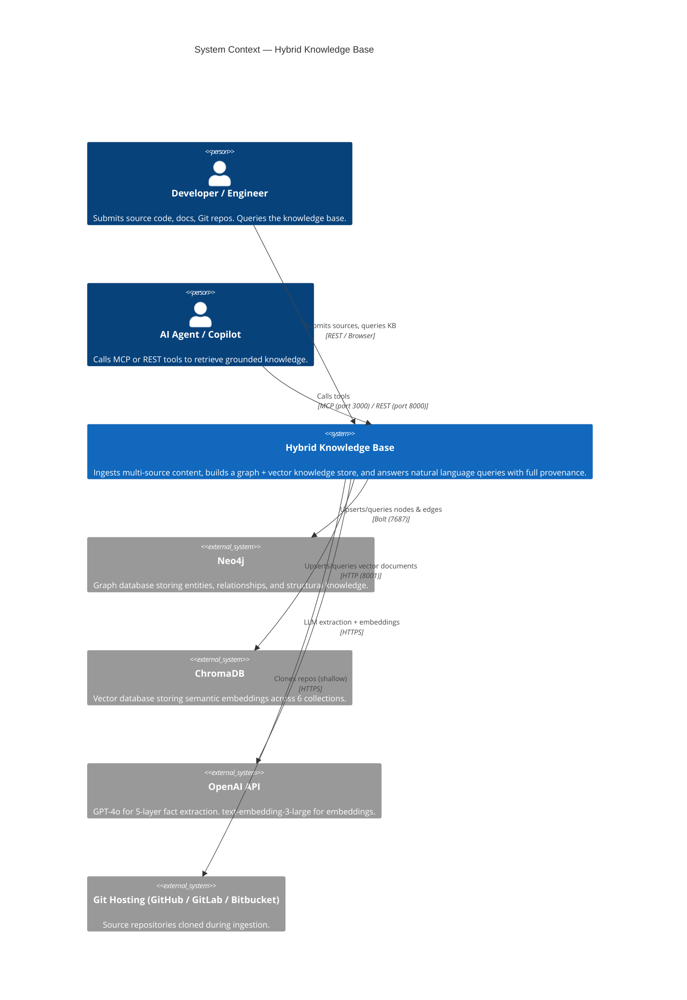
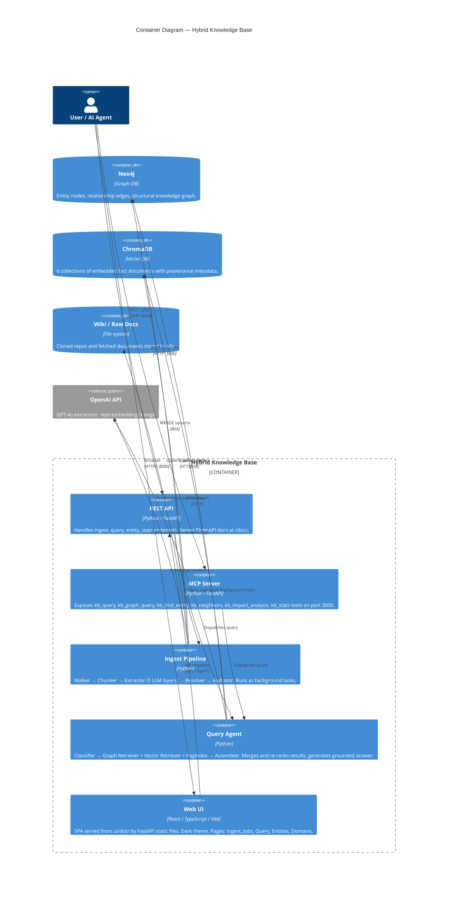
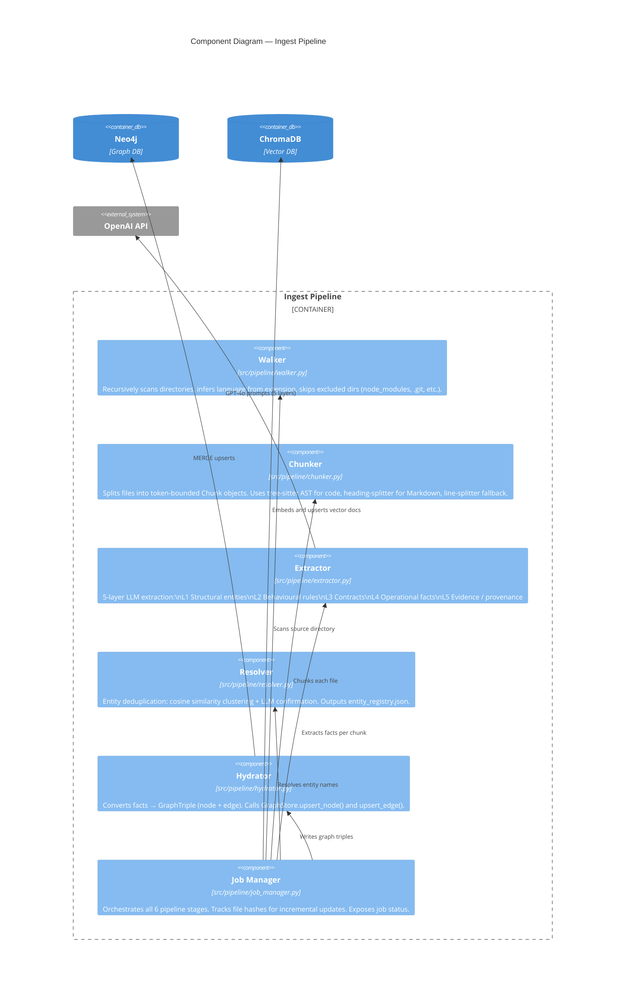
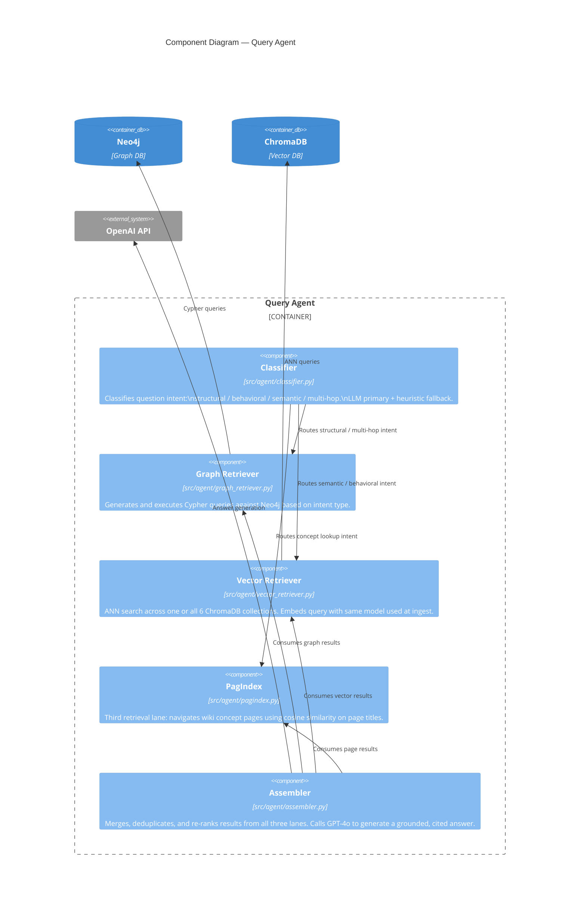

# Hybrid Knowledge Base — PoC

A **Graph + Vector** knowledge base that turns source code, documentation, Git repositories, and web pages into a queryable knowledge graph. Ask natural language questions and receive grounded, cited answers sourced from both structural graph traversal and semantic vector search.

---

## What It Does

| Capability | Detail |
|---|---|
| **Multi-source ingestion** | Code files (C#, C++, TypeScript, JS, Python), Markdown, PDF, Word, HTML, Git repos (GitHub / GitLab / Bitbucket), web URLs |
| **5-layer LLM extraction** | Structural entities → Behavioural rules → Contracts → Operational facts → Evidence / provenance |
| **Knowledge graph** | Neo4j stores classes, functions, interfaces, rules, outcomes, events and their relationships (`CALLS`, `IMPLEMENTS`, `EMITS`, `LEADS_TO`, …) |
| **Vector search** | 6 ChromaDB collections covering every extraction layer for semantic similarity lookup |
| **Hybrid retrieval** | Graph traversal + ANN vector search merged on a shared `graph_node_id` bridge key, then re-ranked by a single assembler |
| **Entity resolution** | Cosine similarity + LLM confirmation collapses aliases (`AuthService`, `authSvc`, `auth-service`) into one canonical node |
| **Incremental updates** | File-hash tracking skips unchanged files; `MERGE`-based upserts make re-runs idempotent |
| **Impact analysis** | "What breaks if I change X?" — downstream traversal via `CALLS`/`EMITS`/`LEADS_TO` edges |
| **Provenance** | Every fact links back to: source file + line range, extraction layer (L1–L5), chunk ID, confidence level |
| **MCP server** | Exposes `kb_query`, `kb_graph_query`, `kb_find_entity`, `kb_neighbors`, `kb_impact_analysis`, `kb_stats` as MCP tools for AI agents and VS Code Copilot |
| **REST API** | FastAPI on port 8000 with auto-generated OpenAPI docs at `/docs` |

---

## Tech Stack

### Backend — API & Pipeline

| Layer | Technology | Version | Notes |
|---|---|---|---|
| Language | Python | 3.11+ | Type-annotated throughout |
| API framework | FastAPI | 0.111+ | Async, CORS, OpenAPI at `/docs` |
| Data validation | Pydantic | v2.7+ | All models — request, response, facts |
| ASGI server | Uvicorn | 0.29+ | Single process local; Gunicorn for production |
| Background tasks | FastAPI `BackgroundTasks` | — | Non-blocking pipeline execution |
| Code chunking | tree-sitter + tree-sitter-languages | 0.22+ / 1.10+ | AST-aware splits at class/method boundaries |
| Token counting | tiktoken | 0.7+ | Enforces per-chunk token budget |
| LLM extraction | OpenAI Python SDK (`gpt-4o`) | 1.x | temperature=0.0 for deterministic extraction |
| Local LLM (optional) | Ollama | — | Drop-in replacement for air-gapped environments |
| Embeddings | `text-embedding-3-large` (OpenAI) | — | `nomic-embed-text` (Ollama) for local dev |
| Entity resolution | scikit-learn | 1.4+ | Cosine similarity clustering |
| Git cloning | gitpython | 3.x | Shallow clone + incremental fetch |

### Graph Database

| Property | Detail |
|---|---|
| **Primary** | Neo4j 5.20 — ACID, Cypher, Browser UI at `http://localhost:7474` |
| **Embedded alt** | Kùzu — no Docker, same Cypher dialect, fast local dev |
| **Connection** | `bolt://localhost:7687` (local) · `neo4j+s://…neo4j.io` (Aura) |
| **Nodes** | `Entity`, `Outcome`, `Event`, `Rule` |
| **Edges** | `CALLS`, `IMPLEMENTS`, `EMITS`, `PRODUCES`, `RESOLVED_BY`, `LEADS_TO` |
| **Node ID** | `SHA-256[:16]` of `canonical_name` — stable, deterministic |
| **Write strategy** | `MERGE` upserts — idempotent; safe to re-run |
| **Switch** | `GRAPH_BACKEND=neo4j` or `GRAPH_BACKEND=kuzu` in `.env` |

### Vector Database

| Property | Detail |
|---|---|
| **Default** | ChromaDB 0.5 — local persistent, HTTP mode via Docker |
| **Alternatives** | Weaviate 1.25 · Qdrant 1.9 · Pinecone (cloud) — same `VectorStore` protocol |
| **Collections** | `BehavioralRule` · `EntityContract` · `OutcomeRecord` · `ObservableEvent` · `OperationalTrace` · `DocumentSection` |
| **Bridge key** | Every vector doc carries `graph_node_id` — the same SHA-256 hash as the graph node |
| **Switch** | `VECTOR_BACKEND=chroma` / `weaviate` / `pinecone` / `qdrant` in `.env` |

### Frontend (Post-MVP UI)

| Concern | Technology | Version |
|---|---|---|
| Framework | React + TypeScript | 18 / 5 |
| Build tool | Vite | 5 |
| Styling | Tailwind CSS (dark-only) | 3 |
| Server state | TanStack Query | v5 |
| Routing | React Router | v6 |
| Serving | FastAPI static files from `ui/dist/` | — |

---

## C4 Architecture Diagrams

### Level 1 — System Context



### Level 2 — Container Diagram



### Level 3 — Component Diagram: Ingest Pipeline



### Level 3 — Component Diagram: Query Agent



---

## Project Structure

```
KnowledgeBasePoC/
├── FR_Doc/
│   ├── knowledge_base_hybrid_requirement.md   # Backend contracts, DB schema, API spec
│   └── knowledge_base_hybrid_spec.md          # UI spec, FR list, tech stack decisions
└── SRC/
    ├── pyproject.toml                          # Python dependencies
    ├── .env.example                            # All environment variables (copy → .env)
    ├── cli.py                                  # CLI entry point (kb serve / mcp / query …)
    ├── README.md                               # SRC-level quick-start reference
    ├── scripts/
    │   └── create_schema.py                    # One-time Neo4j constraints + indexes
    ├── src/
    │   ├── models/
    │   │   └── facts.py                        # Pydantic models: Chunk, EntityFact, RuleFact, …
    │   ├── storage/
    │   │   ├── protocols.py                    # VectorStore + GraphStore Protocol abstractions
    │   │   ├── neo4j_store.py                  # Neo4j implementation (primary)
    │   │   ├── chroma_store.py                 # ChromaDB implementation
    │   │   ├── kuzu_store.py                   # Kùzu embedded alternative
    │   │   └── git_store.py                    # Wiki Git repository management
    │   ├── pipeline/
    │   │   ├── walker.py                       # File system walker
    │   │   ├── chunker.py                      # AST-aware chunker (tree-sitter)
    │   │   ├── extractor.py                    # 5-layer LLM extraction
    │   │   ├── resolver.py                     # Entity deduplication
    │   │   ├── hydrator.py                     # Facts → graph triples
    │   │   └── job_manager.py                  # Ingest orchestrator + job tracking
    │   ├── adapters/
    │   │   ├── git_ingester.py                 # Clone/update Git repos
    │   │   ├── file_ingester.py                # Save uploads, fetch URLs
    │   │   └── wiki_to_json.py                 # Wiki pages → Chunks
    │   ├── agent/
    │   │   ├── classifier.py                   # Intent classification
    │   │   ├── graph_retriever.py              # Cypher-based retrieval
    │   │   ├── vector_retriever.py             # ANN vector retrieval
    │   │   ├── pagindex.py                     # Wiki concept tree retrieval
    │   │   └── assembler.py                    # Merge + rerank + answer generation
    │   ├── api/
    │   │   ├── main.py                         # FastAPI app + CORS + router mounts
    │   │   ├── schemas.py                      # API request/response models
    │   │   └── routes/
    │   │       ├── ingest.py                   # POST /file, /repo, /url; GET/DELETE /jobs
    │   │       ├── query.py                    # POST /query, /graph/analyze
    │   │       ├── stats.py                    # GET /stats, /health
    │   │       └── entities.py                 # GET /entities, /entities/{id}; POST /summarize
    │   └── mcp/
    │       └── server.py                       # MCP tool server on port 3000
    └── tests/
        ├── conftest.py                         # Shared fixtures (mock stores, sample facts)
        ├── test_chunker.py
        ├── test_extractor.py
        ├── test_resolver.py
        └── test_query.py
```

---

## Setup & Run

### Prerequisites

| Requirement | Notes |
|---|---|
| Python 3.11+ | `python --version` |
| Neo4j 5.x | Already installed; must be running at `bolt://localhost:7687` |
| OpenAI API key | Required for LLM extraction and embeddings |
| Git | For repo ingestion |

ChromaDB is installed via pip and runs locally — no Docker needed for local dev.

---

### Step 1 — Create a virtual environment

```powershell
cd KnowledgeBasePoC\SRC
python -m venv .venv
.\.venv\Scripts\Activate.ps1
```

### Step 2 — Install Python dependencies

```powershell
pip install -e ".[dev]"
```

### Step 3 — Configure environment variables

```powershell
Copy-Item .env.example .env
```

Then open `.env` and fill in the required values:

```dotenv
# Required
OPENAI_API_KEY=sk-...

# Neo4j (already running)
NEO4J_URI=bolt://localhost:7687
NEO4J_USER=neo4j
NEO4J_PASSWORD=your-password

# Storage paths (created automatically)
RAW_DOCS_DIR=./raw_docs
WIKI_DIR=./wiki
OUTPUT_DIR=./output

# Optional overrides
LLM_MODEL=gpt-4o
EMBEDDING_MODEL=text-embedding-3-large
VECTOR_BACKEND=chroma
API_PORT=8000
```

### Step 4 — Create the Neo4j schema (once only)

```powershell
python scripts/create_schema.py
```

This creates uniqueness constraints on `Entity.id`, `Outcome.id`, `Event.id`, `Rule.id` and indexes on `canonical_name`, `source_ref`, and `kind`.

### Step 5 — Start the REST API server

```powershell
kb serve
# or directly:
uvicorn src.api.main:app --host 0.0.0.0 --port 8000 --reload
```

Open `http://localhost:8000/docs` to explore the API.

### Step 6 — (Optional) Start the MCP server

```powershell
kb mcp
# or directly:
uvicorn src.mcp.server:mcp_app --host 0.0.0.0 --port 3000
```

To use with VS Code Copilot, add to `.vscode/mcp.json`:

```json
{
  "servers": {
    "kb": {
      "type": "http",
      "url": "http://localhost:3000"
    }
  }
}
```

---

## Ingest Your First Source

### Via REST (curl)

```powershell
# Ingest a Git repository
Invoke-RestMethod -Method Post `
  -Uri "http://localhost:8000/api/ingest/repo" `
  -ContentType "application/json" `
  -Body '{"repo_url": "https://github.com/org/repo", "branch": "main", "max_tokens": 1500}'

# Check job progress
Invoke-RestMethod "http://localhost:8000/api/ingest/jobs/{job_id}"

# Ingest a single file
Invoke-RestMethod -Method Post `
  -Uri "http://localhost:8000/api/ingest/file" `
  -InFile ".\path\to\file.py"
```

### Via CLI

```powershell
kb query "What calls authenticate_user?"
kb query "What are the authentication rules?" --mode vector
kb query "Impact of changing AuthService" --mode graph
```

---

## Key API Endpoints

| Method | Path | Description |
|---|---|---|
| `POST` | `/api/ingest/file` | Upload one or more files |
| `POST` | `/api/ingest/repo` | Clone and ingest a Git repository |
| `POST` | `/api/ingest/url` | Fetch and ingest a web URL |
| `GET` | `/api/ingest/jobs` | List all ingest jobs |
| `GET` | `/api/ingest/jobs/{id}` | Get job status and stage progress |
| `DELETE` | `/api/ingest/jobs/{id}` | Cancel a running job |
| `POST` | `/api/query` | Hybrid RAG query (graph + vector) |
| `POST` | `/api/graph/analyze` | Graph traversal: shortest path, impact, reverse deps |
| `GET` | `/api/entities` | Paginated entity browser |
| `GET` | `/api/entities/{id}` | Entity detail with relationships |
| `POST` | `/api/entities/{id}/summarize` | Regenerate LLM summary for one entity |
| `GET` | `/api/stats` | Graph node/edge counts, vector doc counts |
| `GET` | `/api/health` | Health check |
| `GET` | `/docs` | Auto-generated OpenAPI UI |

---

## MCP Tools

| Tool | What it does |
|---|---|
| `kb_query` | Hybrid natural language query (graph + vector) |
| `kb_graph_query` | Graph traversal — impact, reverse deps, neighbours |
| `kb_find_entity` | Look up an entity by canonical name or alias |
| `kb_neighbors` | Return N-hop neighbourhood of an entity |
| `kb_impact_analysis` | All entities affected downstream if entity X changes |
| `kb_stats` | Graph node/edge counts and vector doc totals |

---

## Running Tests

```powershell
pytest tests/ -v
```

Tests use mocked OpenAI and store clients — no live connections required.

---

## Environment Variable Reference

| Variable | Default | Description |
|---|---|---|
| `OPENAI_API_KEY` | — | **Required** |
| `NEO4J_URI` | `bolt://localhost:7687` | Neo4j connection URI |
| `NEO4J_USER` | `neo4j` | Neo4j username |
| `NEO4J_PASSWORD` | — | **Required** |
| `GRAPH_BACKEND` | `neo4j` | `neo4j` or `kuzu` |
| `VECTOR_BACKEND` | `chroma` | `chroma`, `weaviate`, `qdrant`, or `pinecone` |
| `CHROMA_HOST` | `localhost` | ChromaDB host |
| `CHROMA_PORT` | `8001` | ChromaDB HTTP port |
| `CHROMA_PERSIST_DIR` | `./chroma_data` | ChromaDB local storage path |
| `EMBEDDING_MODEL` | `text-embedding-3-large` | OpenAI or Ollama model name |
| `LLM_MODEL` | `gpt-4o` | Extraction and answer generation model |
| `RAW_DOCS_DIR` | `./raw_docs` | Where cloned repos and files are stored |
| `WIKI_DIR` | `./wiki` | Wiki Git repository root |
| `OUTPUT_DIR` | `./output` | Intermediate extracted JSON files |
| `API_PORT` | `8000` | REST API listen port |
| `MCP_PORT` | `3000` | MCP server listen port |
| `CORS_ORIGINS` | `http://localhost:5173` | Comma-separated allowed CORS origins |

---

## Pipeline Stages (Ingest Job)

```
1. Scan & Chunk          — Walk source directory, split files into token-bounded chunks
2. Extract Facts         — 5-layer LLM extraction per chunk (L1 structural → L5 evidence)
3. Provenance Enrichment — Attach source metadata, git blame, commit SHA
4. Entity Resolution     — Deduplicate aliases, build entity_registry.json
5. Graph DB Insert       — MERGE upsert all nodes and edges into Neo4j
6. Vector DB Embed       — Embed each fact document and upsert into ChromaDB
```

Each stage reports counters (files processed, facts extracted, nodes written) visible via `GET /api/ingest/jobs/{id}`.
