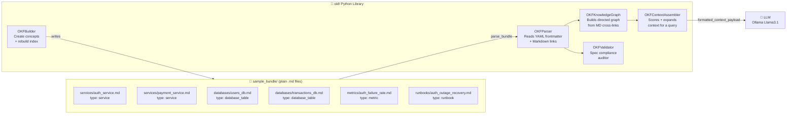
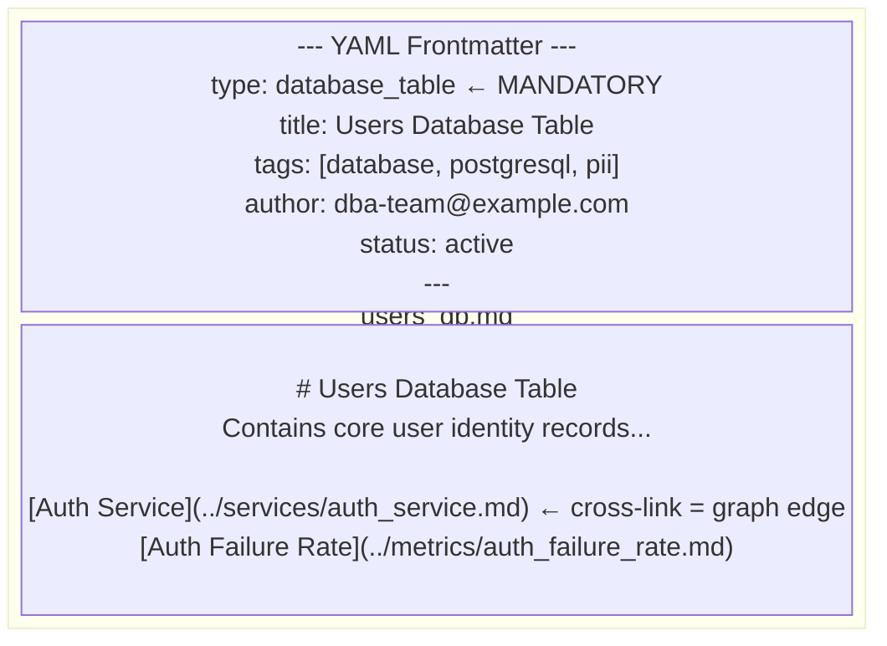
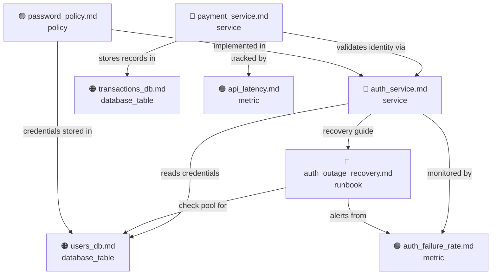
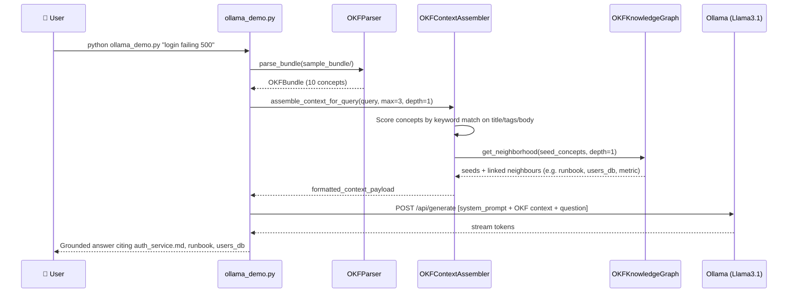

# Google Open Knowledge Format (OKF) - Python Showcase Application

[](https://github.com/GoogleCloudPlatform/knowledge-catalog)
[](https://www.python.org/)
[](LICENSE)

A complete **"Hello World" Python implementation and showcase application** for the **Google Open Knowledge Format (OKF)**.

---

## 🌟 What is Google Open Knowledge Format (OKF)?

Introduced by **Google Cloud in June 2026**, the **Open Knowledge Format (OKF)** is an open, vendor-neutral specification designed to solve the **"context-assembly problem"** for AI systems and human teams. 

Before OKF, AI agents often relied on arbitrary text chunking (e.g., splitting documents into 500-character blocks for RAG pipelines), which loses semantic context, breaks cross-references, and requires proprietary vector databases. 

**OKF formalizes the "LLM-Wiki" pattern** into a clean, file-system-based standard:
- **No lock-in / No SDK needed**: Stored as plain Markdown files with YAML frontmatter.
- **Human & Machine Interoperable**: Fully readable by developers, Git-versionable, and natively traversable by AI Agents.
- **Graph-Oriented**: Intra-bundle Markdown hyperlinks automatically form a queryable **Knowledge Graph**.

---

## �️ How OKF Works — Architecture Overview



---

## �📐 OKF v0.1 Specification Overview

An OKF **Bundle** is a directory tree of Markdown files (`.md`) representing individual units of knowledge ("Concepts").

### 1. Concept Structure & Frontmatter Schema
Every non-reserved `.md` concept file starts with a **YAML Frontmatter block** delimited by `---`:

```markdown
---
type: service
title: User Authentication Service
description: Core OAuth2 & JWT token generation microservice.
resource: https://github.com/org/auth-service
tags:
  - auth
  - security
  - identity
timestamp: 2026-07-21T10:00:00Z
author: security-team@example.com
version: 2.4.0
status: active
---

# User Authentication Service

The **User Authentication Service** handles session validation for all API requests.

## Key Dependencies
- Reads credentials from [Users Database Table](../databases/users_db.md).
- Monitored via [Auth Failure Rate Metric](../metrics/auth_failure_rate.md).
- Incident resolution guide in [Auth Outage Recovery Runbook](../runbooks/auth_outage_recovery.md).
```

### 2. Standard Metadata Fields

| Field | Requirement | Type | Description |
|---|---|---|---|
| `type` | **MANDATORY** | `string` | Defines the category (e.g., `service`, `database_table`, `metric`, `runbook`, `policy`). |
| `title` | Optional | `string` | Display name of the concept. |
| `description` | Optional | `string` | Single-line summary of the concept. |
| `resource` | Optional | `string` | URI or reference to external asset (Git repo, Postgres table, Grafana dashboard). |
| `tags` | Optional | `list[string]` | Keywords for categorization and search. |
| `timestamp` | Optional | `string/ISO-8601` | Date/time when created or updated. |
| `author` | Optional | `string` | Owner or authoring team. |
| `version` | Optional | `string` | Version or SemVer identifier. |
| `status` | Optional | `string` | Concept status (`active`, `draft`, `deprecated`). |

### 3. Reserved System Files
- `index.md`: Central root directory catalog listing all concepts in the bundle.
- `log.md`: Audit log tracking change history (`CREATE`, `UPDATE`, `DELETE`).

### 4. Anatomy of an OKF Concept File



---

## � Sample Bundle Knowledge Graph

The cross-links inside the `.md` files automatically form this directed knowledge graph:



> When you query *"Auth service 500 error"*, the assembler matches `auth_service.md` and then **graph-expands** to automatically include `users_db.md`, `auth_failure_rate.md`, and `auth_outage_recovery.md` — because they are all one hop away.

---

## �🚀 Repository Structure

```
google_okf_demo/
├── README.md                      # Comprehensive documentation
├── demo.py                        # Core OKF showcase (5 demos, no LLM)
├── ollama_demo.py                 # End-to-end LLM demo — OKF + Ollama Llama3.1
├── requirements.txt               # Dependencies (pyyaml, pytest, requests)
├── okf/                           # Core OKF Python library
│   ├── __init__.py
│   ├── models.py                  # OKFFrontMatter, OKFConcept, OKFBundle
│   ├── parser.py                  # YAML frontmatter & markdown link parser
│   ├── validator.py               # OKF v0.1 specification compliance auditor
│   ├── graph.py                   # Knowledge Graph & relationship engine
│   ├── assembler.py               # AI Agent Context Assembler for LLMs
│   └── builder.py                 # Programmatic concept creator & index updater
├── sample_bundle/                 # Realistic OKF Knowledge Bundle (plain .md files)
│   ├── index.md                   # Reserved catalog file
│   ├── log.md                     # Reserved audit log file
│   ├── services/                  # 'service' concepts
│   │   ├── auth_service.md
│   │   └── payment_service.md
│   ├── databases/                 # 'database_table' concepts
│   │   ├── users_db.md
│   │   └── transactions_db.md
│   ├── metrics/                   # 'metric' concepts
│   │   ├── auth_failure_rate.md
│   │   └── api_latency.md
│   ├── runbooks/                  # 'runbook' concepts
│   │   └── auth_outage_recovery.md
│   └── policies/                  # 'policy' concepts
│       └── password_policy.md
└── tests/                         # Pytest unit tests
    └── test_okf.py
```

---

## ⚡ Quick Start

### 1. Installation

Ensure Python 3.9+ is installed.

```bash
pip install -r requirements.txt
```

### 2. Run the Showcase Application

Execute `demo.py` to watch all 5 core OKF capabilities in action:

```bash
python demo.py
```

#### What `demo.py` Showcases:
1. **Parsing & Bundle Inspection**: Recursively parses OKF bundles, grouping concepts by `type`.
2. **Specification Auditor**: Validates frontmatter schema compliance and detects dangling links.
3. **Knowledge Graph Traversal**: Computes in-degree hubs, directional links, backlinks, and shortest traversal paths.
4. **AI Context Assembler**: Demonstrates how an AI agent resolves query context and multi-hop graph nodes into a clean LLM prompt payload.
5. **Programmatic Concept Builder**: Generates new OKF concepts, appends audit entries to `log.md`, and rebuilds `index.md`.

### 3. Run Unit Tests

```bash
python -m pytest tests/test_okf.py
```

### 4. Run the Ollama LLM Demo (AI Incident Assistant)

Requires [Ollama](https://ollama.com) running locally with `llama3.1` pulled.

```bash
# Install extra dependency
pip install requests

# Start Ollama (in a separate terminal)
ollama serve
ollama pull llama3.1

# Run with default auth incident query
python ollama_demo.py

# Run with a custom query
python ollama_demo.py "Payment service is returning 503 errors"
python ollama_demo.py "What columns are in the users table and who owns it?"
```

---

## 💡 Code Examples

### 1. Parsing an OKF Bundle

```python
from pathlib import Path
from okf import OKFParser

bundle = OKFParser.parse_bundle(Path("./sample_bundle"))

# Access parsed concepts
auth_concept = bundle.get_concept("services/auth_service.md")
print("Title:", auth_concept.frontmatter.title)
print("Type:", auth_concept.frontmatter.type)
print("Tags:", auth_concept.frontmatter.tags)
```

### 2. Traversal of Knowledge Graph Relationships

```python
from okf import OKFParser, OKFKnowledgeGraph

bundle = OKFParser.parse_bundle(Path("./sample_bundle"))
graph = OKFKnowledgeGraph(bundle)

# Find what concepts 'auth_service.md' depends on
dependencies = graph.get_outgoing("services/auth_service.md")
for dep in dependencies:
    print(f"Depends on -> [{dep.frontmatter.type}] {dep.relative_path}")

# Find backlinks (what references 'auth_service.md'?)
backlinks = graph.get_incoming("services/auth_service.md")
for src in backlinks:
    print(f"Referenced by <- [{src.frontmatter.type}] {src.relative_path}")
```

### 3. Assembling AI Agent Context for LLMs

```python
from okf import OKFParser, OKFContextAssembler

bundle = OKFParser.parse_bundle(Path("./sample_bundle"))
assembler = OKFContextAssembler(bundle)

# Assemble multi-concept context with 1-hop graph expansion
result = assembler.assemble_context_for_query(
    query="Auth service returning 500 status code",
    max_concepts=2,
    graph_expand_depth=1
)

# Ready-to-use context payload formatted for LLM system prompt
print(result["formatted_context_payload"])
```

### 4. Programmatically Creating Concepts & Updating Catalog

```python
from okf import OKFBuilder, OKFFrontMatter

fm = OKFFrontMatter(
    type="policy",
    title="Data Retention Policy",
    description="Rules for purging old logs.",
    tags=["privacy", "compliance"]
)

OKFBuilder.create_concept(
    bundle_root=Path("./sample_bundle"),
    relative_path="policies/data_retention.md",
    frontmatter=fm,
    body_markdown="# Data Retention Policy\n\nPurge user logs after 90 days.",
    update_log=True
)

# Rebuild index.md catalog
OKFBuilder.rebuild_index(Path("./sample_bundle"))
```

### 5. End-to-End with Ollama (LLM-Grounded Answers)

```python
import requests
from pathlib import Path
from okf import OKFParser, OKFContextAssembler

# 1. Parse the knowledge bundle
bundle = OKFParser.parse_bundle(Path("./sample_bundle"))

# 2. Assemble graph-aware context for the user's query
assembler = OKFContextAssembler(bundle)
result = assembler.assemble_context_for_query(
    query="User login failing with 500 error in Auth Service",
    max_concepts=3,       # top-3 matching seed concepts
    graph_expand_depth=1  # pull in directly linked neighbours
)

# 3. Build prompt and send to Ollama Llama3.1
system = "You are an SRE expert. Answer using ONLY the provided OKF knowledge."
full_prompt = f"{system}\n\n{result['formatted_context_payload']}\n\nAnswer:"

response = requests.post(
    "http://localhost:11434/api/generate",
    json={"model": "llama3.1", "prompt": full_prompt, "stream": False}
)
print(response.json()["response"])
```

#### Ollama Demo Flow



---

## 🎯 Summary of Key Benefits

| Feature | Traditional RAG / Doc Stores | Google Open Knowledge Format (OKF) |
|---|---|---|
| **Chunking** | Arbitrary token/line splits (breaks context) | Semantic concept units bounded by YAML frontmatter |
| **Relationships** | Implicit vector similarity | Explicit directed Knowledge Graph (Markdown links) |
| **Metadata** | Custom DB schemas / vendor SDKs | Standardized YAML Frontmatter (`type`, `tags`, `resource`) |
| **Portability** | Locked into specific vector DBs | Plain text Markdown, Git-versionable, vendor-neutral |
| **Auditability** | Difficult to trace changes | Built-in reserved `index.md` catalog and `log.md` audit trail |

---

## 📜 License

Distributed under the MIT License.
